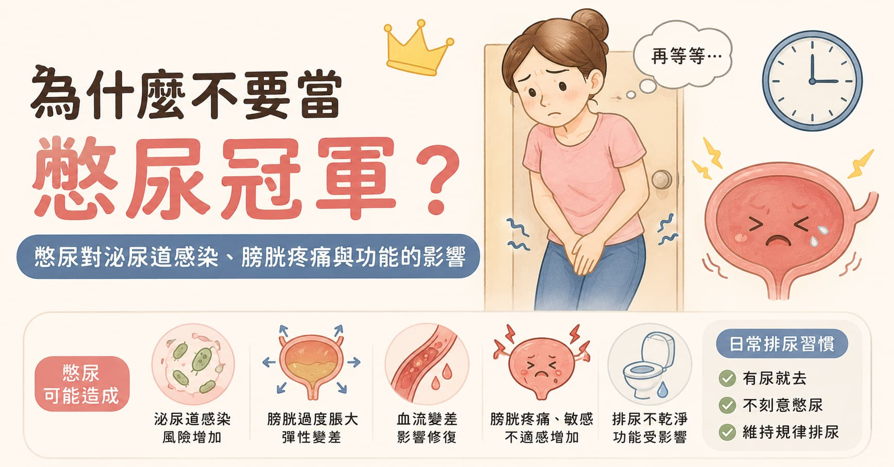

> **摘要：** 憋尿不是忍耐力比賽，也不需要當「憋尿冠軍」。偶爾因為工作、搭車或一時不方便忍一下，通常不會立刻造成永久傷害；但如果長期反覆憋尿，尤其每次都忍到下腹很脹、很痛，可能增加泌尿道感染風險，也可能讓膀胱過度脹大、膀胱壁血流變差，進一步造成膀胱疼痛、膀胱敏感、排尿不乾淨，甚至影響膀胱收縮功能。
> 本文由泌尿科專科醫師周孟翰整理憋尿對泌尿道感染、膀胱缺血、疼痛與功能的影響，並說明怎麼建立比較健康的排尿習慣。

## 憋尿不是意志力訓練

很多人從學生時代就習慣憋尿：下課不想去、工作太忙不想中斷、開車找不到廁所、看診排隊怕錯過、打電動或追劇正精彩。久了以後，甚至會把「很能忍」當成一種能力。

但膀胱不是水桶，也不是越撐越厲害。膀胱是有血流、有神經、有肌肉收縮功能的器官。它需要在儲尿與排尿之間保持協調：尿慢慢變多時，膀胱要能放鬆；要排尿時，膀胱肌肉要能收縮，尿道括約肌與骨盆底肌要能放鬆。

如果總是把尿忍到極限，膀胱長期處在過度撐開的狀態，這套協調機制就可能被影響。

## 憋尿可能帶來哪些問題？

| 影響     | 可能發生的機制                      | 常見表現                 |
| ------ | ---------------------------- | -------------------- |
| 泌尿道感染  | 尿液停留時間變長，細菌較有機會繁殖；若排空變差，風險更高 | 頻尿、尿急、解尿灼熱、下腹悶痛、尿味變重 |
| 膀胱過度脹大 | 膀胱被撐到太滿，膀胱壁張力上升              | 下腹脹痛、很急卻尿不順、尿完仍覺得沒乾淨 |
| 膀胱缺血   | 過度膨脹可能壓迫膀胱壁微血流，讓組織短暫缺氧       | 膀胱疼痛、悶脹、排尿後仍不舒服      |
| 膀胱敏感   | 反覆刺激後，膀胱神經可能變得更容易被尿量或發炎刺激喚醒  | 頻尿、急尿、尿一點點就想跑廁所      |
| 排尿功能變差 | 長期過度撐開可能影響膀胱收縮與排空            | 尿流變弱、排尿要等、剩餘尿增加、反覆感染 |

## 一、憋尿與泌尿道感染：尿不是越久越安全

泌尿道不是無菌堡壘。細菌有時會從尿道口附近往上跑，尤其女性尿道較短，膀胱炎風險本來就比男性高。規律排尿有點像幫泌尿道做沖洗，把尿液與部分細菌排出去。

如果長時間不排尿，尿液停在膀胱裡的時間變長，細菌就有比較多時間附著與繁殖。若同時喝水少、尿液濃縮、性行為後沒有排尿、便秘、糖尿病、免疫力較低，或本來就有排尿不乾淨，感染風險會更明顯。

膀胱炎常見症狀包括：

* 頻尿、尿急
* 解尿灼熱或疼痛
* 下腹悶痛或膀胱脹痛
* 尿味變重、尿液混濁
* 血尿

若合併發燒、畏寒、腰痛、噁心嘔吐，就要小心感染往腎臟上行，應盡快就醫。

> 相關主題：[一直反覆泌尿道感染？女性膀胱炎反覆發作的根本原因與預防方法](/blog/uti-recurrent-female)｜[520 節日特輯｜蜜月膀胱炎](/blog/520-honeymoon-cystitis)

## 二、膀胱過度脹大：撐久了不一定更有力

膀胱有彈性，但彈性不是無限的。尿液越積越多時，膀胱壁會被撐開，膀胱內壓與膀胱壁張力也會上升。

偶爾一次憋尿，通常排掉就舒服了；但如果長期反覆忍到很脹，膀胱可能逐漸習慣更大的容量，尿意感變鈍。聽起來好像變得「很能忍」，但壞處是：你可能不容易察覺膀胱已經很滿，等到真的想尿時又過度脹大。

更麻煩的是，膀胱太脹時不一定比較好尿。有些人會出現：

* 明明很急，坐上馬桶卻尿不太出來
* 尿流變弱、斷斷續續
* 尿完還是覺得下腹脹
* 尿完沒多久又想尿
* 檢查發現剩餘尿增加

這些狀況不一定全部由憋尿造成，也可能和攝護腺肥大、膀胱收縮力不足、糖尿病神經病變、骨盆底肌過度緊繃或藥物有關。但長期憋尿會讓膀胱承受不必要的壓力，尤其已經有排尿困難的人更不適合硬撐。

> 相關主題：[明明常跑廁所，膀胱卻可能沒排空？](/blog/voiding-efficiency-overflow-incontinence)｜[夜尿症完整說明](/blog/nocturia)

## 三、膀胱缺血與疼痛：太脹時血流可能變差

膀胱壁需要血流供應氧氣與養分。當膀胱被尿液撐得很滿，膀胱壁被拉薄、張力上升，微血流可能受到壓迫，造成短暫血流不足。這就是為什麼有些人憋到極限時，不只是「想尿」，而是下腹明顯疼痛、冒冷汗，排尿後還會悶悶不舒服。

若這種過度脹大的狀態反覆發生，膀胱可能從單純不舒服，變成比較容易敏感、疼痛或發炎。臨床上我們不會把所有膀胱疼痛都歸因於憋尿，因為還要排除感染、結石、間質性膀胱炎、骨盆底肌問題、婦科或腸胃道原因；但「經常忍到膀胱很痛」絕對不是值得鼓勵的習慣。

需要注意的是，如果你已經出現反覆膀胱痛、頻尿、尿急，卻驗尿沒有明顯感染，這時更應該就醫評估，而不是靠更用力忍尿來訓練膀胱。

## 四、憋尿也可能讓膀胱功能變差

膀胱排尿靠的是逼尿肌收縮。長期反覆過度撐開，可能影響膀胱肌肉與神經對尿量的感覺，也可能讓排尿時收縮變得不夠有效率。結果不是「膀胱變強」，而是可能變成「膀胱變鈍、排不乾淨」。

如果排尿不乾淨，膀胱裡殘留的尿增加，接著又會增加感染、結石、頻尿與尿急的機會。這也是為什麼泌尿科不只問你一天尿幾次，也會關心尿流、排尿等待、是否中斷、是否滴尿，以及尿完是否仍有殘尿感。

以下族群更不適合長期憋尿：

* 反覆泌尿道感染者
* 已經有排尿困難、尿流變細或剩餘尿偏高者
* 攝護腺肥大患者
* 糖尿病或神經病變患者
* 脊髓損傷、巴金森氏症、中風後排尿問題者
* 長期便秘或骨盆底肌容易緊繃者
* 使用可能影響排尿的藥物者，例如部分感冒藥、抗組織胺、抗憂鬱藥或止痛藥

## 那到底多久尿一次比較好？

沒有每個人都一樣的標準。喝水多、天氣冷、喝咖啡茶酒、服用利尿劑，排尿次數自然會增加；流汗多、喝水少，尿量就會變少。

一般來說，白天約每 1.5–2 小時排尿一次是常見狀況；如果喝水少、流汗多，間隔可能更久。重點不是拿碼表計時，而是不要長期把尿意忽略到「很脹、很痛、快忍不住」才去。

比較健康的做法是：

* 有明顯尿意時，不要一再延後
* 工作或開會前先安排上廁所
* 長途開車或旅行前規劃休息站
* 不要為了少上廁所而整天不喝水
* 運動流汗後適度補水
* 排尿時放鬆，不要急著用力擠尿
* 尿完仍覺得沒乾淨，可稍等一下再放鬆排一次，但不要用力硬擠

## 需要看泌尿科的警訊

如果只是偶爾憋尿後不舒服，通常調整習慣即可。但以下情況建議就醫：

* 頻尿、尿急、解尿灼熱持續超過 1–2 天
* 血尿、尿液混濁或尿味明顯變重
* 下腹痛、腰痛、發燒或畏寒
* 明明很想尿卻尿不出來
* 尿流變弱、排尿要等、尿到一半中斷
* 尿完仍覺得膀胱沒空
* 反覆泌尿道感染
* 憋尿後常出現膀胱疼痛或骨盆疼痛
* 夜尿、頻尿或急尿已影響睡眠與生活

門診可依狀況安排尿液檢查、尿液培養、膀胱超音波、剩餘尿量檢查、尿流速檢查，必要時評估攝護腺、結石、膀胱功能或其他骨盆疼痛原因。

## 總結：膀胱需要規律使用，不需要極限訓練

憋尿偶爾一次，多數人不需要過度恐慌；但長期反覆憋尿，尤其忍到膀胱很脹、很痛，就可能增加泌尿道感染風險，也可能讓膀胱過度脹大、血流變差，進一步造成疼痛、敏感與排尿功能影響。

膀胱健康不是靠忍耐力撐出來的，而是靠規律喝水、適時排尿、不要過度用力、出現感染或排尿異常時及早處理。下一次尿意來的時候，不用急著封自己為憋尿冠軍；找個廁所，讓膀胱好好下班。
