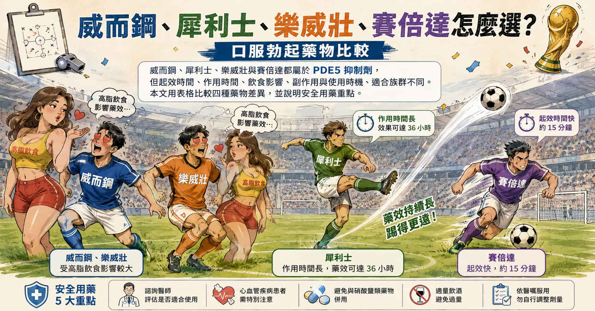

> **摘要：** 威而鋼、犀利士、樂威壯、賽倍達都是常見口服勃起功能障礙藥物，核心機轉都和第五型磷酸二酯酶（PDE5）抑制有關。差別不只是「強不強」，而是起效快不快、作用久不久、是否受飲食影響、犀利士 5 mg 是否適合每日低劑量使用，以及你的心血管狀況和生活型態。
> 本文由新店高美泌尿科周孟翰醫師，用表格和臨床角度比較威而鋼、犀利士、樂威壯、賽倍達，並說明每日使用與需要時使用怎麼區分。若你住在台北、新北、新店、大坪林、七張、安坑、景美或木柵一帶，也可以把這篇當作看診前的基礎整理。

## 診間故事：醫師，我到底該吃哪一顆？

「醫師，我朋友說威而鋼比較有力。」

「另一個朋友又說犀利士比較自然。」

「網路上還有人推樂威壯、賽倍達，說比較快、比較不會被看出來。到底哪一顆最好？」

這類問題在泌尿科門診非常常見。

我的回答通常不是直接說哪一顆最強，而是先問幾個問題：

* 你是偶爾需要，還是每週都有規律性生活？
* 你希望吃了快一點有效，還是希望時間比較彈性？
* 你會不會喝酒、吃大餐後才安排親密時間？
* 你有沒有胸痛、心臟病、正在吃硝酸鹽類藥物？
* 你是否同時有攝護腺肥大、夜尿、尿流細弱等排尿症狀？

因為口服勃起藥物不是在比「誰最大聲」，而是在找「哪一種最適合你」。

## 先講結論：四種藥都是第五型磷酸二酯酶抑制劑

威而鋼、犀利士、樂威壯、賽倍達都是商品名。

真正的藥物成分如下：

| 商品名 | 主要成分       | 特色一句話                          |
| --- | ---------- | ------------------------------ |
| 威而鋼 | Sildenafil | 經典藥物，使用經驗多，通常需要抓服藥時間           |
| 犀利士 | Tadalafil  | 作用時間最長，可需要時使用；5 mg 劑型可作為每日使用選項 |
| 樂威壯 | Vardenafil | 和威而鋼成分類似，部分人覺得硬度反應穩定           |
| 賽倍達 | Avanafil   | 起效較快，適合希望等待時間短的人               |

這些藥都屬於 **第五型磷酸二酯酶抑制劑（PDE5 抑制劑）**。

簡單講，它們不是春藥，不會憑空製造性慾，也不是吃了就自動勃起。

它們比較像是幫身體「延長勃起訊號」的藥。需要有性刺激，藥物才比較能發揮效果。

> 相關主題：[談談性健康與勃起困難](/blog/sexual-health-erectile-dysfunction)｜[威而鋼與高海拔肺水腫](/blog/urology-drugs-sildenafil-hape)

## 勃起的機轉：先有訊號，藥物才接得上

正常勃起需要神經、血管、荷爾蒙和心理狀態一起配合。

當有性刺激時，陰莖神經和血管內皮會釋放一氧化氮（NO）。一氧化氮會讓海綿體裡的環鳥苷酸（cGMP）增加，平滑肌放鬆，血液流進陰莖，勃起才會變硬。

你可以把它想成一個水壩：

* 性刺激：打開進水閘門
* 一氧化氮與環鳥苷酸（NO/cGMP）：讓閘門維持開啟的訊號
* 第五型磷酸二酯酶（PDE5）：負責把訊號拆掉、讓閘門慢慢關起來
* 第五型磷酸二酯酶抑制劑（PDE5 抑制劑）：讓這個酵素暫時慢一點工作，讓環鳥苷酸（cGMP）訊號維持久一點

所以這類藥物的重點是：

**幫你把原本該有的勃起反應放大或延長，但必須有性刺激的情況才能開機。**

如果完全沒有性刺激、睪固酮明顯低下、血管阻塞嚴重、神經受損，或心理壓力很大，單靠一顆藥不一定會有理想效果。

## 四種藥物差異總表

以下是臨床上常用來理解差異的方式。實際劑量、可用品牌與仿單內容，仍需依台灣核准藥品與醫師處方為準。

| 常見商品名 | 成分         | 常見需要時使用時間               | 作用時間概念                | 飲食影響                   |
| ----- | ---------- | ----------------------- | --------------------- | ---------------------- |
| 威而鋼   | Sildenafil | 約性行為前 30-60 分鐘          | 約 4-6 小時              | 高油脂大餐可能延後起效            |
| 犀利士   | Tadalafil  | 約性行為前 30-60 分鐘          | 可長達約 36 小時            | 較不受食物影響                |
| 樂威壯   | Vardenafil | 約性行為前 30-60 分鐘          | 約 4-6 小時              | 高油脂大餐可能影響吸收            |
| 賽倍達   | Avanafil   | 部分人可較快起效，常抓約 15-30 分鐘以上 | 作用時間較偏單次親密安排，不像犀利士那樣長 | 相對較不受飲食影響，但仍建議避免過量飲酒大餐 |

這張表要傳達的是方向，不是要大家自己照表買藥。

同一顆藥在不同人身上的感受可能不同。有些人很在意起效速度，有些人在意副作用，有些人在意「不要每次都像在排程」，有些人則是合併排尿症狀，需要一起考慮。

## 威而鋼：經典、經驗多，但比較需要抓時間

威而鋼是許多人第一個認識的口服勃起功能障礙藥物。

它的優點是使用經驗多、醫師熟悉度高、學名藥選擇多。常見做法是性行為前一段時間服用，讓藥效在親密時間附近發揮。

比較需要注意的是：

* 高油脂大餐可能讓起效變慢
* 常見副作用包括臉紅、頭痛、鼻塞、胃悶
* 少部分人會有視覺色調改變或畏光感
* 不可和硝酸鹽類藥物或肺高壓藥物利奧西呱（riociguat）併用

如果你是偶爾使用、希望藥效時間比較明確，威而鋼常是可以討論的選項。

## 犀利士：時間最長，5 mg 劑型可每日使用

犀利士的特色是作用時間長。

這不代表你會一直勃起 36 小時，而是指身體在有性刺激時，藥物能提供較長的反應窗口。對很多人來說，這種時間彈性會降低「我現在吃了，等一下必須成功」的壓力。

一般犀利士可區分為兩種常見劑型：一種是每日使用的 **5 mg 劑型**，除了勃起功能障礙，目前也發現對於攝護腺肥大所引起的排尿症狀有所幫助；另一種是 **20 mg 劑型**，則適合在性行為前服用。

### 5 mg 劑型：每日使用

每天固定低劑量服用，不是等到性行為前才吃。

犀利士 5 mg 的特色，是透過每天固定服用，讓體內藥物濃度比較穩定。它不是「每天吃比較強」，而是讓親密時間比較不用被服藥時間綁住，也比較能減少臨時吃藥帶來的表現壓力。

另一個臨床上常被討論的特色，是犀利士 5 mg 也可用於合併攝護腺肥大下泌尿道症狀的男性。也就是說，如果病人同時有勃起功能障礙和排尿症狀，例如尿流細弱、頻尿、夜尿或解尿不順，醫師有時會把性功能和排尿問題一起納入考量。

適合：

* 性生活頻率較高
* 不想每次親密前都要算時間
* 因為臨時吃藥而產生表現焦慮
* 同時有攝護腺肥大造成的排尿症狀

### 20 mg 劑型：性行為前服用

20 mg 劑型比較偏向需要時使用，也就是預計性行為前服用。

適合：

* 性生活頻率不固定
* 不想每天吃藥
* 希望一顆藥提供比較長的時間彈性

犀利士也有需要注意的副作用，例如頭痛、臉紅、胃食道逆流感、肌肉痠痛或背痛。若有心血管疾病、正在使用甲型交感神經阻斷劑（alpha-blocker）或降血壓藥，也需要醫師評估。

## 樂威壯：和威而鋼類似，但有自己的注意事項

樂威壯和威而鋼在使用情境上比較接近，多屬需要時使用。

有些患者使用後覺得硬度反應穩定；但這種感受很個人，不能保證每個人都一樣。

需要注意的是：

* 常見副作用仍是頭痛、臉紅、鼻塞、胃悶
* 高油脂餐可能影響部分吸收與起效
* 有心電圖 QT 間期（QT interval）相關風險或正在使用某些影響心律藥物者，需要特別由醫師評估
* 不可和硝酸鹽類藥物或肺高壓藥物利奧西呱（riociguat）併用

如果你曾使用威而鋼效果不穩或副作用不舒服，醫師有時會討論換成樂威壯或其他同類藥物。

## 賽倍達：起效較快，適合不想等太久的人

賽倍達的特色是起效較快。

臨床上常被拿來和其他同類藥物比較「等待時間」。對有些人來說，這很重要，因為親密關係不一定能精準排程。

適合討論賽倍達的情況包括：

* 希望服藥後等待時間較短
* 不喜歡把性行為安排得太像行程表
* 使用其他藥物時副作用明顯，想和醫師討論替代選項

但它一樣不是春藥，也需要性刺激。一樣不能和硝酸鹽類藥物或肺高壓藥物利奧西呱（riociguat）併用。

## 每日使用 vs 需要時使用：差別不只是每天吃或臨時吃

很多人以為每日使用只是「每天吃比較強」，這其實不對。

每日使用和需要時使用的差別，是治療策略不同。

| 用法    | 怎麼吃       | 優點                        | 適合族群                       |
| ----- | --------- | ------------------------- | -------------------------- |
| 需要時使用 | 性行為前才服用   | 不需要每天吃，使用彈性高              | 性生活頻率較低或較不固定者              |
| 每日使用  | 每天固定低劑量服用 | 不用每次親密前算時間，較自然，也可兼顧部分排尿症狀 | 性生活較頻繁、表現焦慮明顯、合併攝護腺肥大排尿症狀者 |

每日使用最常討論的是 **犀利士 5 mg** 低劑量每日使用。

它的概念不是讓你每天都處在「藥效最強」的狀態，而是讓體內藥物濃度較穩定，減少每次性行為前臨時服藥的心理壓力。

但每日使用也不是人人適合。如果一個月性生活只有一兩次，或副作用明顯，需要時使用可能更合理。

## 不是每個人都能吃：安全比藥效更重要

以下狀況一定要先讓醫師知道：

* 正在使用硝酸鹽類藥物，例如舌下含片、硝化甘油貼片、單硝酸異山梨酯或二硝酸異山梨酯（isosorbide 類藥物）
* 正在使用肺高壓藥物利奧西呱（riociguat）
* 最近有心肌梗塞、中風、嚴重心律不整或不穩定心絞痛
* 血壓過低或多種降血壓藥併用
* 正在使用甲型交感神經阻斷劑（alpha-blocker）治療攝護腺肥大或高血壓
* 嚴重肝腎功能異常
* 曾有勃起超過 4 小時、陰莖纖維化或血液疾病
* 曾發生突發視力或聽力異常

如果服藥後出現胸痛，不要自行再吃硝酸鹽類藥物，應立即就醫並告知急診醫師最近使用過第五型磷酸二酯酶抑制劑（PDE5 抑制劑）。

## 網路藥、壯陽保健品最讓醫師擔心

泌尿科醫師最擔心的，不是病人來問藥，而是病人不問就直接買。

很多標榜「天然、超強、立即見效」的產品，可能混入不明劑量的第五型磷酸二酯酶抑制劑（PDE5 抑制劑）或類似成分。問題在於：

* 劑量不清楚
* 成分不清楚
* 可能和心血管藥物交互作用
* 可能延誤糖尿病、高血壓、高血脂、睪固酮低下等真正原因
* 出現副作用時，不知道自己到底吃了什麼

勃起功能變差，有時是血管健康的早期警訊。與其在網路上試藥，不如把血壓、血糖、血脂、荷爾蒙、睡眠與壓力一起評估。

如果你在雙北地區，像是新店、大坪林、七張、安坑，或台北文山區的景美、木柵一帶，想了解威而鋼、犀利士、樂威壯、賽倍達怎麼選，建議由泌尿科醫師一起評估性功能、心血管風險、慢性病與目前用藥。藥物比較只是第一步，安全使用才是重點。

## 守護者的叮嚀

威而鋼、犀利士、樂威壯、賽倍達不是四個不同魔法，而是同一大類藥物的不同性格。

* 想要經典、有經驗：可討論威而鋼
* 想要時間彈性、也可能合併排尿症狀：可討論犀利士
* 想換一種需要時使用選項：可討論樂威壯
* 想等待時間短一點：可討論賽倍達

真正重要的不是「哪一顆最強」，而是：

**你的身體狀況適不適合、你的生活型態需不需要、你的風險能不能被安全管理。**

> 本文為衛教資訊分享，無法取代實際診察。口服勃起功能藥物屬處方藥，實際使用劑量、頻率與禁忌症需由醫師依個人病史、心血管狀況與正在服用藥物評估。若有胸痛、心臟病、近期中風或心肌梗塞、正在使用硝酸鹽類藥物或肺高壓藥物利奧西呱（riociguat），請勿自行服用。\
> 泌尿專科・下半身的守護者｜周孟翰醫師\
> 新店高美泌尿科診所｜服務新店、大坪林、七張、安坑、台北文山區、景美、木柵與雙北男性健康族群

\#威而鋼 #犀利士 #樂威壯 #賽倍達 #Sildenafil #Tadalafil #Vardenafil #Avanafil #PDE5抑制劑 #勃起功能障礙 #每日使用 #需要時使用 #男性健康 #泌尿科 #周孟翰醫師 #下半身的守護者 #新店泌尿科 #大坪林泌尿科 #七張泌尿科 #安坑泌尿科 #台北泌尿科 #新北泌尿科 #雙北泌尿科 #文山區泌尿科 #景美泌尿科 #木柵泌尿科

## 參考資料

* American Urological Association: [Erectile Dysfunction (ED) Guideline](https://www.auanet.org/guidelines-and-quality/guidelines/erectile-dysfunction-\(ed\)-guideline)
* European Association of Urology: [Sexual and Reproductive Health Guidelines](https://uroweb.org/guidelines/sexual-and-reproductive-health)
* MedlinePlus: [Sildenafil](https://medlineplus.gov/druginfo/meds/a699015.html)
* MedlinePlus: [Tadalafil](https://medlineplus.gov/druginfo/meds/a604008.html)
* MedlinePlus: [Vardenafil](https://medlineplus.gov/druginfo/meds/a603035.html)
* MedlinePlus: [Avanafil](https://medlineplus.gov/druginfo/meds/a614010.html)
