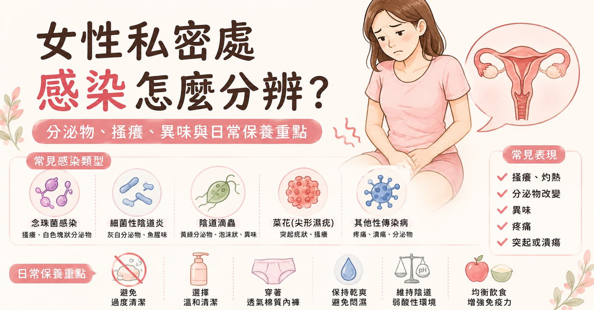

> **摘要：** 女性私密處感染不只一種。搔癢、灼熱、分泌物變多、有異味、性交疼痛、解尿刺痛或外陰部長顆粒，都可能代表不同問題。常見原因包括念珠菌感染，也就是俗稱黴菌感染，常有豆腐渣樣白色分泌物；細菌性陰道炎常見魚腥味與灰白色分泌物；陰道滴蟲感染可能有黃綠色、泡沫狀或味道較重的分泌物；性傳染病則可能造成潰瘍、水泡、尿道或子宮頸感染，菜花則常呈現疣狀或花椰菜樣突起。
> 本文由泌尿科專科醫師周孟翰整理女性私密處感染的常見鑑別、檢查與治療方向，並說明平時如何保養私密處：清潔外陰即可、避免陰道灌洗與過度清潔，讓陰道維持自然的弱酸性保護環境。

## 女性私密處感染，先看分泌物、氣味與症狀組合

很多女性一出現搔癢或分泌物改變，就會直覺以為是「黴菌」。念珠菌感染確實很常見，但不是所有私密處不舒服都是黴菌，也不是每一種感染都能靠同一種塞劑或藥膏處理。

門診判斷時會看幾件事：分泌物是白色、灰白、黃綠還是帶血？質地是豆腐渣、稀水狀、泡沫狀還是黏稠？有沒有魚腥味、搔癢、灼熱、外陰紅腫、性交疼痛、排尿刺痛、下腹痛、發燒，或外陰部水泡、潰瘍、疣狀突起？

這些線索很重要，因為治療方向完全不同。念珠菌用抗黴菌藥；滴蟲需要口服抗生素，伴侶也要處理；菜花需要確認 HPV 病灶並討論冷凍、藥物或雷射等治療；若是淋病、披衣菌、梅毒或疱疹，也各有不同檢查與治療方式。

## 先用一張表看常見原因

| 可能原因                   | 常見表現                               | 治療方向                        |
| ---------------------- | ---------------------------------- | --------------------------- |
| 念珠菌感染 / 黴菌感染           | 外陰陰道搔癢、灼熱、紅腫，白色豆腐渣或乳酪狀分泌物，通常臭味不明顯  | 抗黴菌塞劑、藥膏或口服藥，反覆感染需找誘因       |
| 細菌性陰道炎                 | 灰白色、較稀的分泌物，常有魚腥味，搔癢可輕可重            | 抗生素治療，避免灌洗與過度清潔             |
| 陰道滴蟲感染（trichomoniasis） | 黃綠色、泡沫狀或量多分泌物，異味、搔癢、解尿不適或性交不適      | 口服抗生素，性伴侶需同時治療，治療完成前避免性行為   |
| 菜花 / 尖形濕疣              | 外陰、陰道口、肛門周邊或會陰部疣狀突起，可單顆或多顆，可能像小花椰菜 | 醫師確認診斷後，依位置與數量選擇藥物、冷凍、電燒或雷射 |
| 疱疹 HSV                 | 刺痛、灼熱後出現群聚水泡或疼痛潰瘍，可能反覆發作           | 抗病毒藥物，發作期避免性接觸              |
| 淋病 / 披衣菌               | 可能分泌物增加、排尿刺痛、下腹痛、性交疼痛，也可能無症狀       | 核酸檢測確認後使用抗生素，伴侶需評估與治療       |

## 一、念珠菌感染：典型是豆腐渣樣分泌物與搔癢

念珠菌感染也常被稱為陰道黴菌感染。Candida 本來就可能存在於皮膚、腸胃道或陰道中，當菌叢平衡被打亂、念珠菌過度生長時，就可能造成症狀。

常見症狀包括：

* 外陰或陰道口明顯搔癢
* 灼熱、刺痛、紅腫
* 性交疼痛或解尿時外陰刺痛
* 白色、濃稠、豆腐渣或乳酪狀分泌物
* 通常沒有明顯魚腥味

常見誘因包括近期使用抗生素、懷孕、血糖控制不佳、免疫力較低、長時間悶熱潮濕、緊身褲或護墊長時間悶住。反覆發作時，不應只是一直塞藥，還要評估是否為非白色念珠菌、糖尿病、皮膚炎、過度清潔或其他感染混在一起。

### 治療方向

典型念珠菌感染可使用抗黴菌陰道塞劑、外用藥膏或口服抗黴菌藥。實際選擇要看症狀嚴重度、是否懷孕、是否反覆發作、是否有肝腎功能或藥物交互作用問題。

如果是第一次發作、分泌物有臭味或黃綠色、合併下腹痛、發燒、懷孕，或一年反覆發作多次，建議就醫檢查，不要只靠「看起來像豆腐渣」自行診斷。

## 二、細菌性陰道炎：常見魚腥味與灰白色分泌物

細菌性陰道炎不是單一細菌入侵，而是陰道菌叢失衡。正常情況下，陰道內的乳酸桿菌會幫忙維持弱酸性環境；當乳酸桿菌減少、其他厭氧菌過度生長時，就可能出現分泌物與異味。

常見表現包括：

* 灰白色或乳白色分泌物
* 分泌物較稀、量變多
* 魚腥味，性行為後或月經前後可能更明顯
* 搔癢或灼熱不一定明顯

細菌性陰道炎和陰道灌洗、過度清潔、新性伴侶或多重性伴侶、陰道菌叢改變有關。它不是傳統意義上「性病」，但和性行為型態及陰道菌叢有關，也可能增加某些性傳染病風險。

### 治療方向

症狀明顯時通常使用抗生素治療，例如 metronidazole 或 clindamycin 等，需由醫師依狀況開立。反覆發作時，重點不是把陰道洗得更乾淨，而是避免破壞菌叢的習慣，並確認是否有其他感染一起存在。

## 三、陰道滴蟲感染：常見、可治療，但伴侶也要處理

陰道滴蟲感染的英文是 trichomoniasis，是由陰道滴蟲這種原蟲造成的性傳染病。它很常見，而且可以治療，但麻煩的是許多人沒有症狀，或症狀時好時壞。

女性可能出現：

* 外陰搔癢、灼熱、紅腫或痠痛
* 解尿不適
* 性交疼痛或不舒服
* 透明、白色、黃綠色分泌物增加
* 分泌物較稀、泡沫狀或有魚腥味

單靠症狀無法確診滴蟲。若懷疑滴蟲或有性傳染病風險，醫師會安排陰道分泌物檢查、濕片顯微鏡、快篩或核酸檢測，並視情況同時篩檢淋病、披衣菌、梅毒、HIV 等。

### 治療方向

滴蟲通常使用口服抗生素治療。重點是性伴侶也需要同時評估與治療，否則容易互相傳來傳去。治療完成前應避免性行為，治療後也常需要依醫師建議追蹤，因為再感染並不少見。

## 四、性傳染病：不只分泌物，也可能是水泡、潰瘍或突起

有些女性私密處感染不只表現為分泌物，也可能出現外陰皮膚或黏膜病灶。

### 菜花 / 尖形濕疣

菜花是 HPV 低風險型感染常見造成的生殖器疣，常見於外陰、陰道口、會陰、肛門周邊，也可能在陰道內或子宮頸附近。外觀可能是膚色、粉紅色或灰白色小突起，表面可平滑或粗糙，多顆聚集時可能像小花椰菜。

菜花不一定會痛或癢，所以常常是洗澡、除毛或性伴侶發現後才注意到。治療可依位置、大小與數量選擇外用藥物、冷凍、電燒、雷射或手術移除。HPV 疫苗可降低未來感染特定 HPV 型別與菜花、子宮頸癌相關病變的風險，但不能治療已經存在的病灶。

### 疱疹、梅毒、淋病與披衣菌

疱疹常見水泡、刺痛與疼痛潰瘍；梅毒可能出現不太痛的潰瘍，也可能有全身皮疹；淋病與披衣菌可能造成子宮頸炎、分泌物增加、性交疼痛、解尿刺痛或下腹痛，也可能完全無症狀。

如果近期有新的性伴侶、無套性行為、伴侶有症狀，或自己出現水泡、潰瘍、異常出血、下腹痛、尿道或陰道分泌物改變，建議不要只擦藥觀察，應安排性傳染病篩檢。

> 相關主題：[性傳染病篩檢完整指南](/blog/std-comprehensive-screening)｜[關於菜花你需要知道的四個真相](/blog/genital-warts)｜[HPV 疫苗接種常見問題集](/blog/hpv-vaccine-faq)｜[私密處長水泡是疱疹嗎？](/blog/herpes-simplex-virus)

## 什麼情況需要就醫？

以下情況建議盡快就醫，而不是自行買塞劑或清潔液：

* 第一次出現明顯分泌物異常或私密處搔癢
* 分泌物有明顯魚腥味、惡臭、黃綠色、泡沫狀或帶血
* 有下腹痛、發燒、性交疼痛或骨盆腔疼痛
* 外陰、陰道口或肛門附近出現水泡、潰瘍、菜花樣突起
* 合併排尿疼痛、頻尿、血尿或尿道分泌物
* 懷孕、免疫力較低、糖尿病或正在使用免疫抑制藥
* 一年反覆感染多次，或治療後很快復發
* 近期有新的性伴侶、無保護性行為，或伴侶有症狀

門診可能會依情況安排陰道分泌物檢查、酸鹼值檢測、顯微鏡檢查、細菌或黴菌培養、滴蟲或淋病披衣菌核酸檢測、梅毒與 HIV 抽血檢查，必要時也會檢查子宮頸與外陰病灶。

## 日常私密處保養：重點不是洗得越乾淨越好

陰道本身不是需要「刷洗」的地方。健康陰道有自己的菌叢，其中乳酸桿菌可以幫助維持弱酸性環境，讓不適合的細菌比較不容易過度生長。過度清潔、陰道灌洗、香精產品或反覆使用不必要的殺菌產品，可能破壞這個平衡，反而讓感染、異味與刺激感更容易反覆。

日常保養可以抓住幾個原則：

* 清潔外陰部即可，不要沖洗陰道內部
* 使用清水或溫和、無香精清潔產品，避免用力搓洗
* 不建議陰道灌洗，也不要用醋、小蘇打、茶樹精油或不明偏方沖洗
* 運動流汗、游泳或悶熱後盡快換掉濕衣物
* 選擇透氣內褲，避免長時間穿過緊褲子
* 護墊不要長時間悶著，若非必要不需天天使用
* 月經期間勤換衛生棉、棉條或月亮杯，依產品建議時間使用
* 性行為可使用保險套降低部分性傳染病風險
* 性行為後若容易泌尿道感染，可補充水分並適時排尿
* 不要自行長期反覆使用抗生素、抗黴菌藥或類固醇藥膏

如果常覺得「味道不對」而一直清洗，反而可能讓問題更嚴重。私密處本來就不會完全沒有氣味，真正需要注意的是突然變濃的魚腥味、惡臭、分泌物顏色或質地改變、搔癢、疼痛、出血或長出病灶。

## 總結：分泌物是線索，保養重點是維持平衡

女性私密處感染的表現很多元。豆腐渣樣分泌物常讓人想到念珠菌感染，但魚腥味可能是細菌性陰道炎，黃綠色或泡沫狀分泌物要想到滴蟲，水泡潰瘍與疣狀突起則要考慮疱疹、菜花或其他性傳染病。

最好的日常保養不是把陰道洗到「完全無菌」，而是尊重陰道自然的弱酸性環境與菌叢平衡。外陰清潔、乾爽通風、安全性行為、避免過度清潔，以及有異常時及早就醫，才是讓私密處比較穩定的做法。
