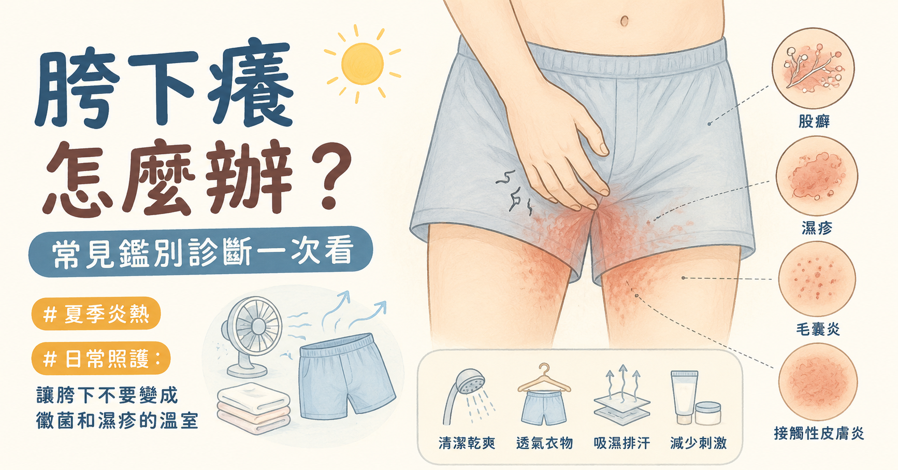

> **摘要：** 胯下癢可以有很多種鑑別診斷，不一定就是股癬。有人是黴菌感染，有人是汗水與摩擦造成的間擦疹（intertrigo），也有人其實是念珠菌感染、紅癬、濕疹、接觸性皮膚炎、毛囊炎、乾癬、疥瘡，甚至和性傳染病相關的水泡、潰瘍或突起有關。
> 本文由泌尿科專科醫師周孟翰整理胯下癢的常見原因、典型外觀、檢查方式與治療方向，幫助你用比較清楚的方式理解：什麼情況可以先調整生活照護，什麼情況需要就醫確認。

## 胯下癢的原因很多：股癬、間擦疹與濕疹都可能

胯下是很容易發炎的區域：溫度高、流汗多、皮膚互相摩擦，內褲與褲子又容易造成悶熱。再加上很多人一癢就抓，皮膚屏障被抓破後，原本單純的刺激也可能變成感染、濕疹或慢性苔癬化。

所以「胯下癢」比較像是一個線索，而不是單一疾病名稱。門診判斷時會看紅疹的位置、邊界、是否脫屑、是否潮濕糜爛、有沒有膿疱或水泡、是否反覆復發，以及近期有沒有流汗悶住、換清潔用品、除毛、性接觸或自行擦藥。

最常見的陷阱，是把所有胯下癢都當成黴菌，或是把所有紅疹都先拿強效類固醇壓下去。前者會讓非黴菌問題拖很久；後者則可能讓真正的股癬變得不典型，範圍更廣、更容易復發。

## 先用一張表看常見鑑別診斷

| 可能原因             | 常見特徵                           | 治療方向                         |
| ---------------- | ------------------------------ | ---------------------------- |
| 股癬（tinea cruris） | 邊界清楚、邊緣隆起脫屑、往外擴張，常不對稱，常延伸大腿內側  | 外用抗黴菌藥、保持乾燥、同時治療足癬或灰指甲       |
| 念珠菌間擦疹           | 潮濕鮮紅、糜爛，常有周邊衛星小丘疹或小膿疱          | 外用抗黴菌藥、減少潮濕摩擦，評估糖尿病或免疫因素     |
| 間擦疹（intertrigo）  | 皮膚皺摺處紅、刺、痛、濕，和流汗摩擦相關           | 乾燥、通風、屏障保護，必要時依感染種類用藥        |
| 紅癬（erythrasma）   | 棕紅色或紅褐色斑，細薄脫屑，常比較不癢或輕微癢        | 外用或口服抗生素，伍氏燈與檢查可輔助診斷         |
| 濕疹 / 接觸性皮膚炎      | 反覆癢、紅、脫屑或滲液，常和清潔用品、藥膏、濕紙巾、摩擦有關 | 避免刺激物、保濕屏障、短期低效價類固醇或非類固醇抗發炎藥 |
| 毛囊炎 / 疔瘡         | 以毛孔為中心的紅疹、膿疱或疼痛腫塊              | 避免刮毛摩擦，必要時抗生素或引流             |
| 反向型乾癬            | 皺摺處光滑紅斑、邊界清楚，身體其他處可能有乾癬或指甲變化   | 皮膚科評估，低效價類固醇、維生素 D 類似物或免疫調節藥 |
| 疥瘡或陰蝨            | 夜間特別癢，伴侶或同住者也癢，可能有抓痕或蟲卵        | 殺蟲藥物，衣物床單處理，伴侶或同住者一起治療       |
| 性傳染病相關病灶         | 水泡、潰瘍、菜花樣突起、尿道分泌物或疼痛           | 依病灶安排 STI 篩檢與針對性治療           |

## 一、股癬：最常被想到的胯下黴菌

股癬的英文是 tinea cruris，是皮癬菌感染造成的胯下黴菌。它常見於鼠蹊部、大腿內側、恥骨附近與臀部皺摺，也常和足癬、灰指甲有關。黴菌可能從腳、指甲、毛巾或衣物帶到胯下。

### 典型特徵

股癬常見表現包括：

* 從鼠蹊皺摺開始，逐漸往大腿內側擴大
* 紅色或紅褐色斑塊，邊界清楚
* 邊緣較活躍，可能隆起、脫屑、有小丘疹或小膿疱
* 中央可能比較淡，形成「中間較乾淨、邊緣較紅」的樣子
* 常不對稱，可能一邊比較嚴重
* 多半很癢，流汗、運動、悶熱後更明顯

一個重要線索是：典型股癬常侵犯鼠蹊與大腿內側，但相對比較少直接侵犯陰囊、陰莖或外陰黏膜。若陰囊整片鮮紅潮濕、糜爛或疼痛，反而要考慮念珠菌、濕疹、刺激性皮膚炎或其他診斷。

### 檢查與治療

外觀典型時，醫師常可依臨床判斷治療；若不典型、反覆發作或治療失敗，可做皮屑 KOH 顯微鏡檢查、黴菌培養，少數情況需要切片排除其他皮膚病。

治療通常包括：

* 外用抗黴菌藥，例如 terbinafine、clotrimazole、miconazole 等
* 洗澡後擦乾鼠蹊與腳趾縫，減少潮濕
* 穿寬鬆、透氣、吸汗的內褲與褲子
* 同時檢查並治療足癬或灰指甲，否則容易反覆帶菌回來
* 避免單獨長期擦類固醇，尤其是強效類固醇

如果範圍很廣、免疫力較低、反覆復發，或外用藥效果不好，醫師可能會評估口服抗黴菌藥。口服藥需考量肝功能、交互作用與是否真的為黴菌感染，不建議自行購買服用。

## 二、念珠菌間擦疹：濕、紅、破皮，常有衛星病灶

念珠菌喜歡潮濕悶熱的皺摺處，常見於肥胖、糖尿病、流汗多、長期悶住、免疫力較低或近期使用抗生素的人。

念珠菌感染常見特徵是皮膚皺摺處鮮紅、潮濕、刺痛或灼熱，可能有糜爛、白白的浸潤感，周邊可見一顆顆小紅疹或小膿疱，稱為衛星病灶。和股癬相比，它通常比較「濕」，邊緣不一定有典型環狀脫屑。

治療方向包括外用抗黴菌藥、保持乾燥、減少摩擦。若反覆念珠菌感染，尤其合併口渴、多尿、體重變化或傷口不易好，應評估血糖與免疫狀態。

## 三、間擦疹：汗水加摩擦造成的皮膚皺摺發炎

間擦疹的英文是 intertrigo。它不是單一病原，而是皮膚皺摺在悶熱、潮濕、摩擦下發炎。它可單純只是刺激，也可能合併念珠菌、皮癬菌、細菌或紅癬。

常見表現是鼠蹊或會陰皺摺處紅、刺、痛、濕、脫皮，走路摩擦時更不舒服。治療重點不是只擦藥，而是把環境改掉：

* 運動或流汗後盡快沖洗、擦乾
* 避免太緊的內褲、牛仔褲或壓縮褲長時間悶住
* 可使用屏障型產品保護容易摩擦的位置
* 若有明顯感染，依檢查結果使用抗黴菌藥或抗生素

## 四、紅癬：像黴菌，但其實常是細菌

紅癬的英文是 erythrasma，由棒狀桿菌相關感染造成，常出現在鼠蹊、腋下、乳房下方等皺摺。它可能呈棕紅色、紅褐色或淡褐色斑塊，邊界可清楚，脫屑通常較細，搔癢可能不明顯。

紅癬容易被誤認為股癬。醫師可用伍氏燈、皮屑檢查或臨床特徵判斷。治療通常不是抗黴菌為主，而是外用或口服抗生素，因此如果「股癬藥」擦很久沒效，要重新確認診斷。

## 五、濕疹與接觸性皮膚炎：越洗越癢、越擦越糟

胯下皮膚很敏感，很多刺激物都可能讓它發炎，例如：

* 香精沐浴乳、私密處清潔液、肥皂過度清潔
* 濕紙巾、除毛膏、潤滑液、保險套成分
* 內褲鬆緊帶、染料、洗衣精殘留
* 自行混擦藥膏、草本藥膏或不明成分止癢藥
* 汗水、尿液、精液或分泌物長時間刺激

接觸性皮膚炎可能很癢，也可能刺痛、紅腫、脫皮、滲液。慢性反覆搔抓後，皮膚會變厚、變深、紋路變粗，形成苔癬化，這時即使原本誘因消失，也會進入「癢、抓、更癢」的循環。

治療重點是停用可疑刺激物、簡化清潔、修復皮膚屏障。需要抗發炎藥時，胯下皺摺通常以低效價類固醇短期使用或非類固醇外用藥為主，強效類固醇長期使用可能造成皮膚變薄、萎縮、妊娠紋或黴菌惡化。

## 六、毛囊炎、疔瘡與化膿性汗腺炎

如果癢之外還有一顆顆以毛孔為中心的紅疹、膿頭，或是疼痛腫塊，就要考慮毛囊炎或疔瘡。刮毛、除毛、悶熱流汗、緊身衣物與摩擦都可能誘發。

若反覆在鼠蹊、腋下、臀溝出現深部疼痛結節、膿瘍、流膿、疤痕或隧道狀傷口，則要考慮化膿性汗腺炎。這不是單純「清潔不夠」，需要皮膚科或相關專科長期治療。

## 七、乾癬、脂漏性皮膚炎與其他慢性皮膚病

反向型乾癬常出現在鼠蹊、腋下、臀溝等皺摺，外觀可能是邊界清楚、光滑發紅的斑塊，因為皺摺處潮濕，反而不一定有典型厚厚銀白色皮屑。若頭皮、手肘、膝蓋或指甲也有乾癬變化，診斷會更有線索。

脂漏性皮膚炎也可能侵犯鼠蹊，常伴隨頭皮屑、眉毛、鼻翼、耳後或胸前反覆泛紅脫屑。這類慢性皮膚病的治療和股癬不同，若誤以為黴菌反覆擦抗黴菌藥，效果通常有限。

## 八、別忘了疥瘡、陰蝨與性傳染病

胯下癢若有以下情況，需要把傳染性原因納入考量：

* 夜間特別癢，伴侶或同住者也開始癢
* 陰毛處看到小蟲、蟲卵或明顯抓痕
* 出現水泡、疼痛潰瘍、菜花樣突起
* 合併尿道分泌物、排尿疼痛、鼠蹊部淋巴結腫
* 最近有新的性伴侶或無保護性行為

疥瘡與陰蝨需要殺蟲治療與衣物床單處理；皰疹、梅毒、菜花、淋病、披衣菌等則需要依病灶與風險安排檢查。不要因為「只是癢」就忽略性傳染病鑑別。

> 相關主題：[性傳染病篩檢完整指南](/blog/std-comprehensive-screening)｜[私密處長水泡是疱疹嗎？](/blog/herpes-simplex-virus)｜[關於菜花你需要知道的四個真相](/blog/genital-warts)

## 什麼情況建議就醫？

以下情況不建議繼續自行買藥試：

* 擦藥 1–2 週仍沒有改善，或越擦越擴大
* 反覆發作，一流汗或性行為後就復燃
* 有疼痛、水泡、潰瘍、流膿、惡臭或發燒
* 鼠蹊部淋巴結腫痛
* 合併尿道分泌物、排尿灼熱或血尿
* 糖尿病、免疫力低下、正在化療或使用免疫抑制藥
* 不確定是不是菜花、疱疹或其他性傳染病

門診可能會依狀況安排皮屑 KOH 檢查、黴菌培養、細菌培養、伍氏燈檢查、STI 篩檢，或在不典型病灶時轉介皮膚科進一步切片。

## 日常照護：讓胯下不要變成黴菌和濕疹的溫室

不論最後診斷是哪一種，這些習慣都很重要：

* 洗澡後把鼠蹊、陰囊下方、臀溝與腳趾縫擦乾
* 運動流汗後盡快換掉濕內褲
* 選擇透氣、合身但不緊繃的內褲
* 避免長時間穿悶熱緊身褲
* 私密處清潔以清水或溫和清潔為主，不要過度搓洗
* 毛巾、內褲不要共用，內褲與襪子分開處理更好
* 若有足癬或灰指甲，應一起治療
* 不要自行混擦多種藥膏，尤其是不明成分或強效類固醇

## 總結：胯下癢不是一種病，而是一個線索

胯下癢的原因很多，股癬只是其中之一。判斷時要看位置、邊界、是否脫屑、是否潮濕糜爛、有沒有衛星病灶、是否以毛囊為中心、是否有水泡潰瘍，以及是否和流汗、摩擦、清潔用品或性接觸有關。

如果只是輕微悶熱摩擦，改善乾燥通風可能就好；但若反覆、擴大、疼痛、破皮、流膿，或擔心性傳染病，就應該讓醫師實際檢查。把診斷弄清楚，治療才會精準，也比較不會在「越癢越擦、越擦越亂」的循環裡打轉。
