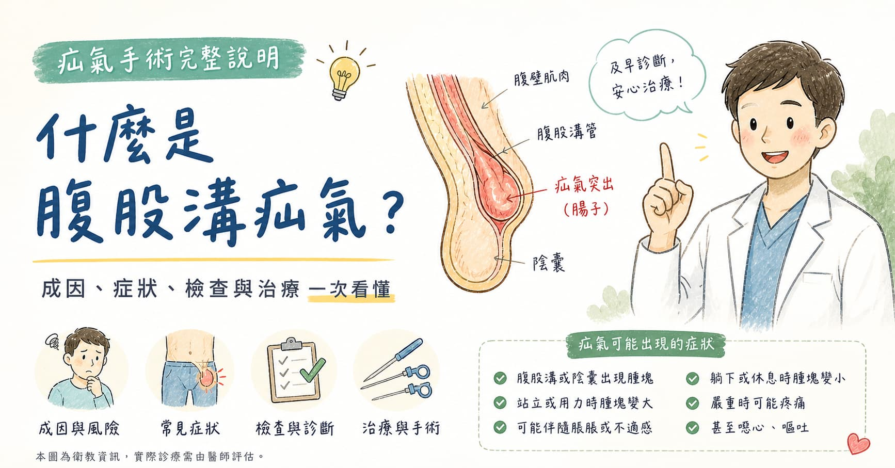

> **摘要：** 疝氣（Hernia）是指腹壁某處出現缺損，導致腹腔內組織（通常是腸道或脂肪）穿出到不應存在的位置。腹股溝疝氣（Inguinal Hernia）是最常見的類型，約佔所有疝氣的 75%，男性發生率約為女性的 10 倍。疝氣無法自行復原，若發生嵌頓（腸道卡住無法推回）需緊急手術處理。目前主流手術包括開放式人工網膜修補與腹腔鏡（微創）修補，兩者復發率均低於 2%。
> 本文由泌尿科專科醫師周孟翰說明腹股溝疝氣的成因、各類型疝氣的特徵、手術方式比較，以及術後恢復與復發預防。

## 鼠蹊部出現腫塊，是疝氣嗎？

「醫師，我左邊鼠蹊部有一顆會消失的腫塊，坐著就看不到，站起來或用力就跑出來，有時候會有點悶悶的。」\
「我不想開刀，可以先觀察嗎？」

這是泌尿科與一般外科門診中非常常見的描述。疝氣本身不會自行復原，而且隨著時間推進，腫塊可能逐漸增大，甚至發生嵌頓——這是需要緊急手術的急症。

無論年齡，只要發現鼠蹊部或陰囊出現可推回的腫塊，都應盡早讓外科或泌尿科醫師評估。\

## 什麼是疝氣？

疝氣是腹壁出現**結構性缺損**，使腹腔內容物（腸道、脂肪組織）由缺損處突出至不應在的位置。

疝氣依位置分類：

| 類型                  | 好發位置      | 好發族群            |
| ------------------- | --------- | --------------- |
| **腹股溝疝氣**（Inguinal） | 鼠蹊部       | 男性，尤其中老年；嬰幼兒亦常見 |
| 股疝氣（Femoral）        | 鼠蹊部下方大腿根處 | 女性較多；嵌頓風險高      |
| 臍疝氣（Umbilical）      | 肚臍周圍      | 嬰幼兒、孕婦、肥胖者      |
| 切口疝氣（Incisional）    | 手術疤痕處     | 有腹部手術史者         |

**腹股溝疝氣**是最常見的類型，約佔所有疝氣的 75%，本文重點說明此類型。

## 腹股溝疝氣的成因

腹股溝區域存在天然的「弱點」——精索（男性）或子宮圓韌帶（女性）由腹壁穿出的腹股溝管。這個通道在出生後理應逐漸閉合，但若先天閉合不全或後天腹壁弱化，即可能形成疝氣。

**先天性疝氣**：嬰幼兒時期常見，出生時腹股溝管未完全閉合。

**後天性腹股溝疝氣**的風險因素：

* **長期腹壓增加**：慢性咳嗽（如吸菸者）、慢性便秘、前列腺肥大導致排尿費力
* **重體力勞動**：長期搬重物、工廠工人
* **肥胖**：腹壁承受壓力過大
* **老化**：腹壁肌肉與筋膜隨年齡退化
* **家族史**：腹壁結締組織強度有遺傳傾向

## 疝氣有哪些症狀？

**典型症狀：**

* **鼠蹊部或陰囊出現可推回的腫塊**：站立、用力、咳嗽時更明顯；躺下後可縮回
* **患部悶痛或壓迫感**：長時間站立或活動後加重
* **陰囊腫脹**：疝氣內容物滑入陰囊時出現

**非典型或無症狀：**
部分早期疝氣患者完全沒有不適感，只在健康檢查或腹部超音波時偶然發現。

### 警示：嵌頓疝氣

當疝出的腸道或組織卡在腹壁缺損處**無法推回**，稱為「嵌頓疝氣（Incarcerated Hernia）」；若血液循環被阻斷，稱為「絞窄疝氣（Strangulated Hernia）」，屬泌外科急症，可能造成腸壞死。

嵌頓疝氣的警示症狀：

* 原本可推回的腫塊**突然無法縮回**
* 腫塊迅速變硬、觸痛明顯
* 伴隨劇烈腹痛、噁心嘔吐
* 發燒

**出現以上症狀請立即就醫。**

## 疝氣會自己好嗎？能只「觀察」嗎？

簡短答案：**疝氣不會自行修復。**

腹壁的結構性缺損不會因休息而癒合，多數疝氣會隨時間逐漸增大。

對於**症狀輕微、且有其他手術風險的老年患者**，醫師確實可能建議「謹慎觀察」而非立即手術。但對於健康狀況良好、有症狀的成人，手術修補才是根本解決方法。

> 疝氣帶（疝氣腰帶）可暫時固定疝出組織，但無法治癒疝氣，不建議長期使用。

## 疝氣手術方式比較

目前主流的疝氣修補方式分為兩大類：

### 開放式人工網膜修補術（Lichtenstein Repair）

* **手術方式**：在鼠蹊部做約 4–6 cm 切口，直接將人工網膜（Mesh）固定在腹壁缺損處
* **麻醉**：可考慮局部、脊椎（半身）或全身麻醉
* **優點**：技術成熟、適合複雜案例
* **缺點**：傷口較大，術後疼痛稍多，恢復稍慢

### 腹腔鏡疝氣修補術（Laparoscopic Repair）

目前主流術式有兩種：

* **TAPP（腹腔內進入腹膜前修補）**：進入腹腔，翻開腹膜放置網膜後再縫合覆蓋
* **TEP（完全腹膜外修補）**：不進入腹腔，直接在腹膜外空間操作

|           | 開放式     | 腹腔鏡（TAPP/TEP）   |
| --------- | ------- | --------------- |
| **傷口**    | 4–6 cm  | 3 個 0.5–1 cm 孔洞 |
| **術後疼痛**  | 中度      | 較輕微             |
| **恢復上班**  | 約 1–2 週 | 約 5–7 天         |
| **重體力勞動** | 4–6 週後  | 3–4 週後          |
| **雙側疝氣**  | 需兩個切口   | 同一傷口可修補雙側       |
| **復發率**   | \< 2%   | \< 1–2%         |
| **費用考量**  | 較低      | 較高（依材料）         |

**腹腔鏡手術特別適合：**

* 雙側腹股溝疝氣
* 復發疝氣（原開放式手術後復發）
* 需要快速恢復工作的患者

## 人工網膜安全嗎？

目前用於疝氣修補的人工網膜（通常為聚丙烯材質）已使用超過 50 年，安全性已有大量臨床數據支持。使用網膜可將疝氣復發率從早期純縫合的 10–15% 降低至目前的 **\< 2%**。

極少數患者可能出現：

* 網膜周圍纖維化或慢性疼痛（\< 5%）
* 網膜感染（\< 0.5%，極罕見）

整體而言，使用網膜的益處遠超過風險。

## 術後恢復與注意事項

### 一般術後時程

* **術後當日**：可正常飲食，建議步行活動
* **術後 1–3 天**：局部腫脹、瘀青屬正常，冰敷可緩解
* **術後 1 週**：多數患者可恢復輕度辦公工作
* **術後 3–4 週（腹腔鏡）/ 4–6 週（開放式）**：可恢復運動、搬重物

### 術後須注意的情況

* 傷口**持續紅腫熱痛或滲液**：可能是感染，需回診
* 術後出現**腫塊再次突出**：可能是早期復發，須就醫評估
* **陰囊腫脹**：術後常見，通常 2–4 週內自然消退
* **小便困難**：全身麻醉或脊麻後偶發，若超過 6 小時無法排尿需通報

## 如何預防疝氣復發？

手術後降低復發的生活建議：

* 術後初期**避免用力抬重**（依術式和醫師指示）
* **戒菸**：慢性咳嗽是疝氣復發的重要危險因子
* **治療便秘**：排便費力會長期增加腹壓
* **維持健康體重**：肥胖增加腹壁壓力
* 若有**攝護腺肥大**造成排尿困難，應同步治療

## 什麼情況應該就醫？

| 情況           | 建議             |
| ------------ | -------------- |
| 鼠蹊部出現可推回的腫塊  | 泌尿科或一般外科門診評估   |
| 腫塊變硬、突然無法推回  | **立即急診**（嵌頓疝氣） |
| 伴隨劇烈腹痛、嘔吐、發燒 | **立即急診**（可能絞窄） |
| 術後傷口持續紅腫化膿   | 回診評估           |

## 周醫師的提醒

疝氣是一個需要手術的結構性問題，但它也是一個相對安全、恢復迅速的手術。腹腔鏡技術的進步讓多數患者在術後 1 週即可恢復日常工作，且雙側疝氣可在同一手術中一次完成修補。

如果你在新店(如大坪林、七張)、安坑、景美、木柵(文山區)、永和、中和及深坑等一帶，發現鼠蹊部有疑似疝氣的症狀，歡迎至新店高美泌尿科診所預約門診，讓周孟翰醫師為你評估是否需要手術，以及最適合的手術方式。
