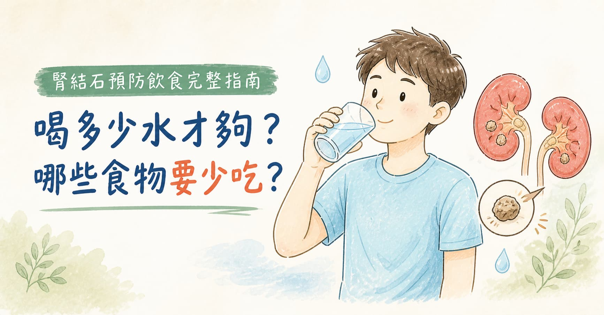

> **摘要：** 腎結石（Nephrolithiasis/Urolithiasis）依成分分為草酸鈣（70–80%）、磷酸鈣（5–10%）、尿酸（10–15%）及感染性結石（Struvite）等類型，各有不同的飲食調整重點。所有類型共通的最重要預防策略是**足量水分攝取**（每日尿量目標 ≥ 2 公升，對應飲水量 ≥ 2.5 公升），其次為限制鈉、動物蛋白質攝取，以及依結石種類個別調整草酸或普林攝取量。「多吃鈣質會長結石」是常見迷思——適量飲食鈣反而有助預防草酸鈣結石。
> 本文由泌尿科專科醫師周孟翰說明腎結石的成因、各結石類型的飲食對策，以及在台灣高溫環境下維持足夠尿量的實際建議。

## 「排完結石就沒事了嗎？」

「醫師，上週剛排出一顆結石，痛到掛急診。現在沒事了，但聽說很容易再長？」\
「我平常有在碧潭騎腳踏車跑步，是不是因為流汗太多才長結石？」

對於住在新店、碧潭一帶的戶外運動族來說，夏季高溫下大量流汗又補水不足，確實是腎結石的典型成因。但光靠「多喝水」還不夠——不同種類的結石，有各自的飲食禁忌。

腎結石排出後，**5 年內復發率約 50%**。預防復發需要了解自己是哪一種結石，再針對性調整飲食。

## 結石是怎麼形成的？

結石形成的核心機制是**尿液中特定物質濃度過高**，超過溶解度後析出結晶，逐漸聚集成石。

影響溶解度的主要因素：

* **尿液量不足**：水分減少，所有溶質濃度上升
* **尿液 pH 值**：尿酸結石在酸性尿中形成；磷酸鈣結石在鹼性尿中形成
* **飲食中特定物質過多**：草酸、鈣、普林（嘌呤）的攝取量
* **代謝性問題**：高鈣尿症、高草酸尿症、高尿酸血症、副甲狀腺功能亢進等

## 腎結石的主要類型

手術中若條件允許，會將結石送檢進行成分分析，確認成分後才能精準調整飲食。若無法取得結石，24 小時尿液分析（測定草酸、鈣、尿酸、檸檬酸等）是次佳選擇。

| 結石類型                       | 比例     | 尿液 pH 特徵     | 主要誘因           |
| -------------------------- | ------ | ------------ | -------------- |
| **草酸鈣（Calcium Oxalate）**   | 70–80% | 中性至偏酸        | 高草酸飲食、低鈣攝取、脫水  |
| **磷酸鈣（Calcium Phosphate）** | 5–10%  | 鹼性           | 腎小管性酸中毒、副甲狀腺亢進 |
| **尿酸（Uric Acid）**          | 10–15% | 持續酸性（\< 5.5） | 高普林飲食、痛風、代謝症候群 |
| **感染性（Struvite）**          | 5%     | 鹼性（> 7.0）    | 反覆泌尿道感染（尿素酶菌）  |
| **胱氨酸（Cystine）**           | \< 1%  | —            | 先天性代謝異常        |

## 最重要的共通策略：補水

無論哪種結石，**水分是最有效的預防工具**，沒有之一。

**目標尿量：每日 ≥ 2,000 mL**

達到這個目標需要喝多少水？視出汗量而定：

| 情境                 | 建議每日飲水量               |
| ------------------ | --------------------- |
| 久坐辦公室、無大量運動        | **2,000–2,500 mL**    |
| 輕度戶外活動（散步）         | **2,500–3,000 mL**    |
| 中強度運動（騎車、慢跑）1 小時以上 | **3,000 mL 以上**，運動後補充 |
| 夏季戶外工作者            | **3,500 mL 以上**       |

**如何判斷是否喝夠？** 最簡單的方法是看尿液顏色——**淡黃色到無色**代表水分足夠；若呈深黃色，代表需要增加飲水。

> 在新店碧潭一帶晨跑或騎車的運動族，夏季 1 小時運動流失的汗水可達 800–1,000 mL，運動前後都需要積極補水。

## 草酸鈣結石的飲食重點（最常見類型）

### 減少高草酸食物

草酸是植物的天然有機酸，攝取後部分在腸道中被吸收，再由腎臟排出至尿液中。尿液草酸濃度高，便容易與鈣結合析出。

**高草酸食物（每日攝取量需適量控制）：**

* 深色葉菜：**菠菜**（草酸含量最高）、地瓜葉、甜菜根
* 堅果類：**花生**、杏仁、腰果
* 巧克力與可可製品
* 濃茶（尤其紅茶）
* 草莓、奇異果

> 不需要完全戒除，而是**避免單次大量攝取**。菠菜偶爾少量食用不成問題，但每天大碗菠菜就是風險。

### 正確認識鈣——補鈣反而有幫助

「得了草酸鈣結石，是不是要少吃鈣？」這是最常見的飲食誤區。

正確觀念恰恰相反：**飲食中適量的鈣，能在腸道中與草酸結合，形成不可吸收的草酸鈣，減少草酸進入血液的量，從而降低尿液中草酸濃度。**

* **建議**：每日攝取 1,000–1,200 mg 飲食鈣（牛奶、優格、豆腐、小魚乾）
* **隨餐攝取**：鈣和草酸需要在腸道中同時存在才能結合；若鈣補充劑與餐點分離服用，這個效果就消失了
* **鈣補充劑**：若需要補鈣，請**隨餐服用**，空腹吃鈣片反而可能增加尿鈣排出，提高結石風險

### 限制鈉的攝取

飲食中鈉過高，會促使腎臟排出更多鈣（即高鈣尿症），導致尿液中鈣濃度升高。

* 建議每日鈉攝取量：**\< 2,300 mg（相當於 6 克食鹽）**
* 減少加工食品、泡麵、罐頭、醬料

### 限制過量動物蛋白質

動物蛋白質代謝後產生酸性負荷，會：

1. 增加尿液鈣排出
2. 降低尿液檸檬酸（Citrate）濃度——檸檬酸是天然的結石抑制因子
3. 增加草酸前驅物（羥脯氨酸）的代謝

建議每日動物蛋白質（肉、魚、蛋、海鮮）攝取量控制在**0.8–1 g/公斤體重**。

### 增加檸檬酸攝取

檸檬酸（Citrate）是尿液中天然的結石抑制劑，能與鈣結合形成可溶性複合物，阻止草酸鈣結晶析出。

* 每日 100–150 mL 新鮮**檸檬汁**（加水稀釋，非市售含糖飲料）
* 或**柑橘類水果**（橘子、柳橙、葡萄柚）

### 限制維生素 C 大劑量補充

維生素 C 在體內代謝的最終產物之一即為草酸。每日補充超過 **1,000 mg** 的維生素 C 可能顯著升高尿液草酸濃度。建議從天然食物攝取維生素 C，避免高劑量補充劑。

## 尿酸結石的飲食重點

尿酸結石的形成有兩個關鍵：**血尿酸過高**（痛風體質）與**尿液持續偏酸（pH \< 5.5）**。飲食調整針對這兩點進行。

### 低普林飲食

普林（Purine）是尿酸的前驅物，大量存在於：

**需嚴格限制（高普林食物）：**

* 動物內臟（肝、腎、腦、腸）
* 紅肉（每餐以一個手掌大小為上限）
* 高普林海鮮：鱸魚、沙丁魚、鯷魚、蛤蜊、牡蠣
* 酒精，尤其**啤酒**（同時含高普林且妨礙尿酸排出）

**可適量攝取：**

* 雞肉、豬肉（去皮）、白色魚類
* 豆類（豆製品的普林雖高，但植物普林對血尿酸影響相對小）

### 鹼化尿液

尿酸在 pH \< 5.5 的酸性尿中極易析出結晶。鹼化尿液的飲食策略：

* 多攝取蔬菜與水果（產生鹼性代謝物）
* 避免高蛋白質、高脂肪飲食（促進酸性尿）
* 醫師可能處方**碳酸氫鈉（小蘇打）或檸檬酸鉀**藥物，維持尿液 pH 在 6.0–6.5

### 避免長時間禁食或低醣飲食

長時間禁食、斷食或極低醣飲食（生酮飲食）會引發酮酸血症，使血尿酸濃度急速升高，同時導致尿液酸化——是尿酸結石的完美風暴。若需要進行間歇性斷食，請先與醫師評估。

## 磷酸鈣結石——代謝問題優先

磷酸鈣結石通常與**腎小管性酸中毒（RTA）或副甲狀腺功能亢進**有關，飲食調整效果有限，最重要的是找出並治療潛在代謝疾病。

基本原則與草酸鈣結石相似（限鈉、限動物蛋白、足量水分），但此類患者不需要特別限制草酸。

## 感染性結石——以預防泌尿道感染為核心

感染性結石（Struvite）由具有尿素酶活性的細菌（奇異變形桿菌、克雷伯菌等）反覆感染泌尿道所產生，飲食改變效果有限。預防策略在於：

* 積極治療泌尿道感染
* 大量補水、確保排尿完全
* 女性注意性行為後排尿習慣

## 腎結石預防飲食一覽

| 飲食策略               | 草酸鈣     | 尿酸 | 所有類型 |
| ------------------ | ------- | -- | ---- |
| 每日飲水 ≥ 2,500 mL    | ✅       | ✅  | ✅    |
| 限制鈉（\< 2,300 mg/日） | ✅       | ✅  | ✅    |
| 限制動物蛋白質            | ✅       | ✅  | ✅    |
| 減少高草酸食物            | ✅       | —  | —    |
| 飲食鈣攝取足量（隨餐）        | ✅（有助預防） | —  | —    |
| 低普林飲食              | —       | ✅  | —    |
| 鹼化尿液（蔬果、檸檬酸鉀）      | —       | ✅  | —    |
| 戒酒、尤其啤酒            | —       | ✅  | —    |
| 增加檸檬酸攝取（檸檬水）       | ✅       | —  | —    |
| 避免高劑量維生素 C 補充劑     | ✅       | —  | —    |

## 哪些情況應該就醫？

| 情況                 | 建議                   |
| ------------------ | -------------------- |
| 曾排出腎結石，想了解如何預防復發   | 泌尿科門診，必要時做 24 小時尿液分析 |
| 家族中多人有腎結石病史        | 早期評估代謝性成因            |
| 痛風合併腎結石            | 泌尿科＋腎臟科或新陳代謝科共同追蹤    |
| 結石反覆復發（2 年內超過 2 次） | 積極評估代謝原因，考慮藥物預防      |
| 單側腎臟結石合併腎功能異常      | 優先評估，避免阻塞性腎病變        |

## 周醫師的提醒

飲食調整是腎結石預防的核心，但「**最重要的事永遠是喝水**」——在新店、碧潭一帶從事戶外活動的民眾，夏季流汗量大，更要養成主動補水的習慣，不要等口渴才喝。

若你曾有腎結石病史，最理想的做法是：**取得結石送化驗，或做 24 小時尿液分析**，找出你個人的代謝風險因子，再針對性調整飲食——而不是對所有食物都戒得戰戰兢兢。

歡迎到新店高美泌尿科診所預約，讓周孟翰醫師協助你建立個人化的結石預防計畫。
