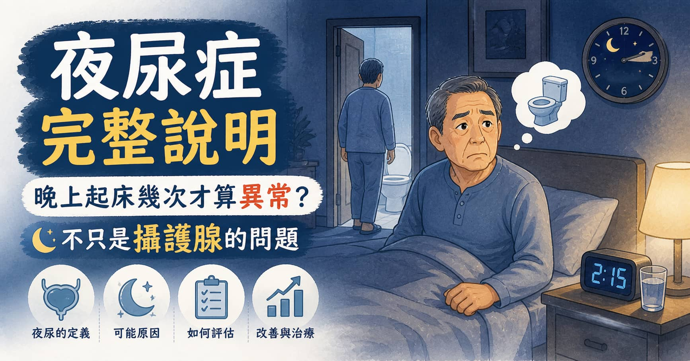

> **摘要：** 夜尿症（Nocturia）定義為每晚醒來排尿 **2 次或以上**，且每次排尿都是因為尿意而醒。夜尿症不是單一疾病，而是多種不同原因的共同表現：夜間多尿（最常見，佔 70-80%）、全身性多尿（糖尿病、尿崩症）、膀胱儲尿能力下降（OAB、BPH）或睡眠障礙（睡眠呼吸中止症）。許多患者以為一定是攝護腺問題，但找錯原因、用錯治療，症狀自然不會改善。本文由泌尿科專科醫師周孟翰說明夜尿症的病因分類、排尿日誌診斷工具，以及各類型的治療方向。

## 「每天晚上都要起來尿 3、4 次，整晚根本睡不好……」

「醫師，我每天晚上要起來尿三次，有時候四次，睡眠斷斷續續，白天整個人很累。我朋友說是攝護腺肥大，但我才 45 歲，應該還不到那個年紀吧？」

「我吃了攝護腺藥，頻尿是比較好一點，但夜尿改善不多，這是怎麼回事？」

夜尿症是泌尿科門診中最常被低估的症狀之一。它不只影響睡眠品質，長期睡眠中斷更與心血管疾病、糖尿病、跌倒骨折（尤其老人）的風險上升有直接關聯。而且，夜尿症的根本原因往往**不只是攝護腺肥大**，如果沒有找對病因，再好的藥物也事倍功半。

## 幾次算夜尿症？

**夜尿症的臨床定義：每晚至少 2 次因尿意而醒來排尿，且此狀況影響生活品質。**

每晚起來 1 次，通常不算異常（尤其 50 歲以上）。但每晚 2 次以上，且讓你難以入睡或影響白天精神，就值得進一步評估。

## 四大類病因：夜尿不只是一種問題

這是夜尿症診斷的核心觀念——**相同的症狀，背後可能是截然不同的原因**，治療方向也完全不同。

### 第一類：夜間多尿（Nocturnal Polyuria）— 最常見

**定義：** 夜間尿量超過每日總尿量的一定比例（老年人 >33%；年輕人 >20%）

**成因：** 身體在夜間製造過多尿液，原因包括：

* **腿部水腫**：白天水分滯留在下肢，躺下後水分回流、腎臟排出，夜間尿量因此增加。常見於心臟衰竭、靜脈功能不全、長期久坐
* **睡前飲水過多**（尤其咖啡因、酒精、含糖飲料）
* **抗利尿激素（ADH）分泌異常**：正常情況下夜間 ADH 上升抑制尿量，老年人此機制常退化
* **使用利尿劑**：若傍晚服用，夜間排尿量增加

**辨識方式：** 排尿日誌中，夜間尿量佔全日的比例偏高。

### 第二類：全身性多尿（Global Polyuria）

每日總尿量 >3,000 mL，白天與夜間都在頻繁排尿：

* **糖尿病（血糖控制不佳）**：高血糖引起滲透性利尿
* **尿崩症**（中樞性或腎性）：ADH 分泌或作用障礙
* **原發性多飲症**：習慣性大量飲水

### 第三類：膀胱儲尿能力下降

每次尿量少、頻繁有尿意，常見於：

* **膀胱過動症（OAB）**：膀胱逼尿肌不穩定收縮，引發急尿和頻尿（詳見 [膀胱過動症完整指南](/blog/overactive-bladder-oab)）
* **攝護腺肥大（BPH）**：尿道阻力增加導致膀胱敏感（詳見 [攝護腺肥大完整說明](/blog/bph)）
* **慢性膀胱炎**：持續發炎降低膀胱容量
* **膀胱腫瘤或結石**：刺激膀胱壁

**辨識方式：** 排尿日誌中，每次尿量偏少（\<200 mL），但白天也有頻繁排尿的問題。

### 第四類：睡眠障礙

有些人並非因尿意而醒，而是**睡眠品質不佳**（易醒），醒來後順手去廁所，誤以為是夜尿症：

* **睡眠呼吸中止症（Obstructive Sleep Apnea, OSA）**：打鼾、夜間缺氧導致反覆醒來；研究顯示 OSA 會刺激心房分泌利鈉肽（ANP），增加夜間尿量，是夜尿症常被忽視的原因
* **失眠、焦慮**：容易在夜間醒來
* **疼痛（關節炎、背痛）**：疼痛造成睡眠中斷

## 如何找出夜尿症的原因？排尿日誌

**排尿日誌（Voiding Diary / Frequency-Volume Chart）** 是診斷夜尿症最重要的工具，可以在就醫前或就醫當下填寫：

記錄內容（連續 3 天）：

* 每次排尿的**時間**
* 每次排尿的**尿量**（用量杯估量）
* 每次的**飲水量與時間**
* 是否因尿意而醒（還是本來就醒著）

**從日誌可以計算：**

* 夜間尿量佔全日比例 → 判斷是否為夜間多尿
* 最大排尿量（Maximal Voided Volume）→ 評估膀胱容量
* 夜間排尿次數與尿量關係 → 分辨類型

## 診斷流程

除了排尿日誌，門診評估還包括：

* **尿液分析與空腹血糖**：排除泌尿道感染、糖尿病
* **腎功能與電解質**：評估腎臟濃縮能力
* **攝護腺超音波與殘尿測量**（男性）：評估 BPH
* **詢問睡眠史**：打鼾嚴重、白天嗜睡者需轉介睡眠科評估 OSA

## 各類型夜尿症的治療方向

| 病因類型             | 治療重點                                                   |
| ---------------- | ------------------------------------------------------ |
| **夜間多尿（腿部水腫）**   | **傍晚彈性壓力襪 + 抬腿休息**；若心臟問題需**治療原發疾病**                    |
| **夜間多尿（ADH 不足）** | Desmopressin（去氨加壓素）：**人工合成 ADH**，睡前服用，**注意低血鈉**（老年人慎用） |
| **全身性多尿（糖尿病）**   | 改善血糖控制為首要                                              |
| **OAB（膀胱過動）**    | 抗膽鹼藥（如 Solifenacin）或 Mirabegron；行為治療                   |
| **BPH（攝護腺肥大）**   | Alpha 受體阻斷劑（如 Tamsulosin）                              |
| **睡眠呼吸中止症**      | CPAP 正壓呼吸機；部分患者夜尿症狀可顯著改善                               |
| **睡前飲水過多**       | 傍晚後限制液體攝取，避免咖啡因與酒精                                     |

### 生活調整通則（所有類型適用）

* **睡前 2–3 小時**避免大量飲水，以及咖啡因（咖啡、茶、可樂）與酒精（利尿效果強）
* 若有腿部水腫，可在睡前 1–2 小時**抬高雙腳**，讓滯留水分提前回流排出
* 白天規律適量飲水，不要為了「少夜尿」而白天也刻意不喝水

## 什麼情況應就醫評估？

| 情況                  | 建議               |
| ------------------- | ---------------- |
| 每晚夜尿 ≥2 次，持續超過 1 個月 | 泌尿科門診，攜帶 3 天排尿日誌 |
| 攝護腺藥物治療後夜尿改善不明顯     | 重新評估是否為夜間多尿或 OSA |
| 合併明顯打鼾、白天嗜睡、早晨頭痛    | 考慮睡眠呼吸中止症，轉介睡眠科  |
| 每日尿量過多（>3 L）、合併口渴   | 排除糖尿病、尿崩症        |
| 老年人夜間如廁頻繁，有跌倒風險     | 盡快評估並減少夜起次數      |

## 周孟翰醫師的提醒

夜尿症對生活品質的影響常常被低估，「老了就這樣」的想法讓很多人長期睡眠不足而不求醫。但夜尿症有很大比例是可以治療改善的，前提是找對原因。

很多人以為「夜尿 = 攝護腺肥大 = 吃攝護腺藥」，但若根本原因是腿部水腫、睡眠呼吸中止或飲水習慣，再怎麼吃攝護腺藥也效果有限。

排尿日誌是你在就診前就可以開始準備的最有用工具——帶著它來新店高美泌尿科診所，讓周孟翰醫師一起幫你找出睡眠中斷的真正原因。
