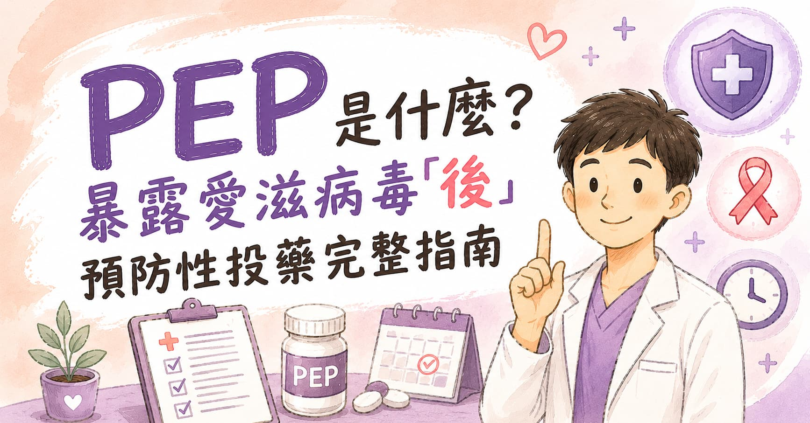

> **摘要：** PEP（Post-Exposure Prophylaxis，暴露愛滋病毒「後」預防性投藥）是在可能接觸 HIV 之後，盡快使用抗病毒藥物，降低病毒在體內建立感染的機會。它是「事後急救」，不是日常防護；重點是**越早越好，最好 24 小時內，最晚 72 小時內開始，並連續服藥 28 天**。
> 本文由新店高美泌尿科周孟翰醫師整理 PEP 的使用情境、就醫時間、用藥流程、追蹤檢查、副作用與和 PrEP 的差別，提供新店、大坪林、七張、安坑、景美、木柵與文山區民眾作為 HIV 預防衛教參考。

## PEP 是什麼？事後急救，不是事後保證

PEP 可以想成「疑似接觸 HIV 後的緊急煞車」。

如果 HIV 真的進入身體，病毒需要一段時間複製、擴散，才會建立穩定感染。PEP 的目的，就是在這段時間內用抗病毒藥物壓住病毒複製，降低感染成立的機會。

但請記得兩件事：

* PEP 不是 100% 保證
* PEP 不是拖到心情比較平靜再處理的事情

如果剛發生疑似暴露，最重要的不是先上網看到半夜，而是**立刻確認時間、整理暴露情境，盡快就醫評估**。

> 相關主題：[PrEP 是什麼？暴露愛滋病毒「前」預防性投藥完整指南](/blog/prep-hiv-prevention)｜[如何透過藥物預防性傳染病](/blog/std-medication-prevention)

## 什麼情況可能需要 PEP？

PEP 主要用在「最近 72 小時內」發生可能接觸 HIV 的情境，常見包括：

* 無套性行為，且對方 HIV 狀態不明
* 性行為中保險套破裂、滑脫，或未全程使用
* 伴侶為 HIV 感染者，且病毒量或服藥狀態不確定
* 遭受性侵害
* 共用針具、針頭或注射器
* 醫療或職業暴露，例如針扎、血液或體液接觸破損皮膚或黏膜

不過，並不是所有接觸都需要 PEP。像是擁抱、握手、共用馬桶、一般社交接觸，或完整皮膚碰到汗水、口水，通常不屬於 HIV 傳染風險情境。

### 哪些體液比較需要注意？

| 需要評估的暴露     | 說明                  |
| ----------- | ------------------- |
| 血液          | 針扎、共用針具、血液接觸破損皮膚或黏膜 |
| 精液、前列腺液     | 無套陰道性交、肛交，或保險套破裂滑脫  |
| 陰道分泌物、直腸分泌物 | 黏膜接觸時需評估風險          |
| 母乳          | 特殊情境需由醫師評估          |

PEP 的判斷不是用「我很怕」或「我覺得應該沒事」決定，而是看暴露途徑、對方 HIV 狀態、是否有出血或黏膜接觸，以及距離暴露已經過了多久。

## 黃金時間：72 小時內，越早越好

PEP 最重要的關鍵是時間。

| 距離暴露時間   | 建議                                        |
| -------- | ----------------------------------------- |
| 0–24 小時  | 最理想，請盡快就醫評估並開始第一劑                         |
| 24–72 小時 | 仍可能有機會，越早開始越好                             |
| 超過 72 小時 | 已非標準建議時間窗，仍應盡快就醫，由醫師個案評估；門診實務上最長延遲不建議超過一週 |

如果你人在新店、文山區、景美、木柵、大坪林或七張附近，發生高風險暴露時，\*\*建議第一時間就醫並評估PEP可行性。\*\*若當下不是門診時間，應優先前往有提供 PEP 評估的急診或疾管署公布的 PEP 服務院所，不要等到隔週門診。

## 新店高美 PEP 門診流程

以下為新店高美泌尿科門診 PEP 流程重點，實際檢查與藥物仍依現場評估與院所公告為準。

### 一、開始治療條件

* 建議在暴露後 **72 小時內**開始使用，越早越好。
* 若已超過 72 小時，仍可先就醫評估暴露風險與後續檢查；門診實務上，最長延遲不建議超過一週。
* 若已超過可用藥時間窗，重點會轉為 HIV 與性病篩檢、空窗期追蹤，以及是否需要銜接 PrEP。

### 二、首次就診

首次就診會先確認暴露時間、暴露方式、對方 HIV 狀態、是否有出血或黏膜接觸，並安排抽血與用藥評估。

| 項目     | 內容                                           |
| ------ | -------------------------------------------- |
| 抽血檢查   | 肝腎功能、B 型肝炎、梅毒、HIV、HCV、HIV rapid test；女性需加驗懷孕 |
| PEP 藥物 | Biktarvy（BIC/TAF/FTC）                        |

### 三、回診追蹤

| 時間點  | 追蹤重點                                   |
| ---- | -------------------------------------- |
| 一週後  | 回診看檢驗報告，確認副作用、服藥規律性與是否需調整追蹤            |
| 六週後  | 若病人焦慮，可先回診驗 HIV combo test             |
| 三個月後 | 追蹤 HIV、RPR、TPHA；若六週已驗 HIV，三個月仍建議完成梅毒追蹤 |

如果反覆需要 PEP，代表未來仍可能持續暴露於 HIV 風險。這時不建議每次都靠事後補救，應和醫師討論是否轉為 [PrEP 暴露愛滋病毒「前」預防性投藥](/blog/prep-hiv-prevention)，讓預防策略更穩定。

## PEP 藥物怎麼吃？

PEP 通常是多種抗病毒藥物組合，療程為**連續 28 天**。實際藥物需由醫師依個人狀況、腎功能、肝功能、懷孕可能、過敏史、交互作用與藥物可近性選擇。

新店高美泌尿科目前 PEP 用藥以 \*\*Biktarvy（bictegravir / tenofovir alafenamide / emtricitabine，簡稱 BIC/TAF/FTC）\*\*為主。它是整合酶抑制劑搭配兩種核苷酸或核苷類反轉錄酶抑制劑的三合一藥物。

這些名稱聽起來很像外星語，但對病人來說，最重要的是：

1. 醫師評估後盡快開始第一劑。
2. 每天按照處方吃，不要自己減量。
3. 吃滿 28 天，不要症狀消失或覺得應該沒事就停。
4. 若未規律服藥、吐藥或出現副作用，盡快聯絡醫療團隊調整。

### Biktarvy 使用注意事項

| 注意事項            | 說明                                         |
| --------------- | ------------------------------------------ |
| 嚴重肝功能異常         | 不可使用，需由醫師改採其他處理方式                          |
| 腎功能 Ccr \< 30   | 不可使用，需評估其他替代方案                             |
| Rifampin        | 不可合併使用，可能降低 bictegravir 濃度，增加治療失敗與抗藥性風險    |
| 胃藥、制酸劑、含金屬離子補充品 | 建議與 Biktarvy 間隔至少 2 小時以上，實際間隔依藥品種類由醫師或藥師確認 |
| 合併 B 型肝炎        | 停藥後可能出現肝炎 flare up，需安排腸胃科或肝膽腸胃科監測          |

正在使用抗結核藥、癲癇藥、特定抗生素、保健食品或胃藥的人，請務必主動告知醫師。PEP 很急，但越急越不能漏掉藥物交互作用。

### 實際情境範例

**範例一：保險套破裂**

小林在週六凌晨性行為時發現保險套破裂，對方 HIV 狀態不確定。他在 12 小時內到診所評估，抽血檢查後開始 PEP，並預約後續追蹤。這是比較理想的處理方式。

**範例二：無套性行為後隔天才開始擔心**

阿傑隔天下午才意識到風險，距離性行為約 30 小時。這時不要因為「已經過一天」就放棄，仍在 72 小時內，應盡快就醫評估 PEP。

**範例三：已經超過 72 小時**

如果距離暴露已經超過 72 小時，PEP 通常已不是標準建議時間窗。但這不代表「不用處理」。仍建議盡快就醫，醫師會依暴露方式、距離時間與個人狀況評估是否仍有處理空間；門診實務上最長延遲不建議超過一週，並需安排 HIV、梅毒、淋病、披衣菌、B 型肝炎、C 型肝炎等檢查與後續追蹤。

## 開始 PEP 前通常會做哪些檢查？

PEP 很趕時間，但不是盲目吃藥。常見評估包括：

| 檢查或評估項目                   | 目的                               |
| ------------------------- | -------------------------------- |
| HIV rapid test、HIV 抗原抗體檢測 | 確認目前是否已感染 HIV；若已感染，不能只用 PEP 劑量處理 |
| 腎功能、肝功能                   | 評估藥物安全性與是否需調整用藥                  |
| B 型肝炎、C 型肝炎               | 暴露後評估與後續追蹤，部分抗病毒藥物也會影響 B 肝       |
| 梅毒、淋病、披衣菌等 STI 檢查         | PEP 只能預防 HIV，不能處理其他性傳染病          |
| 懷孕檢查                      | 有懷孕可能者需選擇合適藥物並評估風險               |
| 用藥史、過敏史                   | 避免藥物交互作用與禁忌症                     |

如果時間很緊，醫師可能會在抽血後先給第一劑，之後再依檢驗結果調整。重點是不要為了等全部報告出來，而錯過 PEP 的黃金時間。

## PEP 期間要注意什麼？

### 一、這 28 天要把藥吃完

PEP 失敗常見原因包括開始太晚、沒有吃滿療程、未規律服藥，或療程中又發生新的高風險暴露。建議把服藥時間固定在每天同一個時段，例如早餐後或睡前，並設定手機提醒。

### 二、療程中仍要避免新的暴露

PEP 不是「開無敵星星」。療程期間仍建議：

* 全程使用保險套與水性潤滑液
* 避免共用針具
* 暫緩捐血
* 若有新的高風險暴露，需告知醫師重新評估時間軸

### 三、安排追蹤檢查

追蹤時間會依院所、檢驗方法與個人風險調整。常見安排包括：

| 時間點    | 追蹤重點                                        |
| ------ | ------------------------------------------- |
| 起始當天   | HIV rapid test、HIV、肝腎功能、B/C 肝炎、梅毒與其他 STI 評估 |
| 一週後    | 回診看檢驗報告，確認副作用、服藥規律性與後續安排                    |
| 約 6 週  | 若病人焦慮，可先回診驗 HIV combo test                  |
| 約 3 個月 | 追蹤 HIV、RPR、TPHA；若六週已驗 HIV，三個月仍建議完成梅毒追蹤      |

如果中間出現發燒、喉嚨痛、皮疹、淋巴結腫大、極度疲倦等類似急性 HIV 感染症狀，不要自己判斷是感冒或藥物副作用，請回診評估。

## PEP 有哪些副作用？

多數人可以完成療程，但可能出現一些暫時性副作用：

* 噁心、胃不舒服
* 腹瀉或軟便
* 頭痛、疲倦
* 異常夢境、暈眩、失眠
* 肝功能或腎功能數值變化

副作用不等於一定要停藥。很多狀況可以透過飯後服藥、調整時間、止吐或止瀉藥物處理。真正需要注意的是嚴重過敏、呼吸困難、皮疹合併發燒、黃疸、尿量明顯變少、嚴重腹痛等狀況，這時應立即就醫。

## PEP 和 PrEP 差在哪？

| 項目   | PEP            | PrEP            |
| ---- | -------------- | --------------- |
| 使用時機 | 可能暴露 HIV 後     | 可能暴露 HIV 前      |
| 性質   | 緊急補救           | 事前預防            |
| 開始時間 | 暴露後 72 小時內越早越好 | 暴露前先規劃          |
| 療程   | 通常 28 天        | 依風險型態每日或需要時服用   |
| 適合對象 | 單次或偶發高風險暴露     | 持續或反覆有 HIV 暴露風險 |

如果你發現自己不是第一次需要 PEP，代表生活型態中可能存在持續風險。這時候與其每次事後焦慮，不如和泌尿科或感染科醫師討論是否改用 PrEP，讓預防策略更穩定。

## 在新店、文山區遇到疑似暴露，可以怎麼說？

就醫時不用把故事包裝得很漂亮。醫療人員需要的是時間和風險資訊，不是道德審判。

你可以直接說：

「我在幾小時前有無套性行為，對方 HIV 狀態不確定，想評估 PEP。」

或是：

「性行為時保險套破掉，距離現在大約 18 小時，想做 HIV 暴露後預防評估。」

如果在新店、大坪林、七張、景美、木柵或文山區附近，平日可至泌尿科或感染科評估 HIV 與性病篩檢；但若仍在 72 小時內且門診無法即時處理，請優先前往急診或疾管署公布的 PEP 服務院所。

## 下半身的守護者提醒

PEP 的重點不是「事後不要緊張」，而是「緊張可以，但要緊張得有效率」。

先記下暴露時間，盡快就醫，配合檢查，吃滿 28 天，完成後續追蹤。若未來仍可能反覆暴露，再把 PrEP、保險套、性病篩檢、B 肝疫苗與 HPV 疫苗一起納入長期性健康管理。

好的性健康照護，是願意在關鍵時間做正確的決定，及時就診評估。

> 📌 本文為衛教資訊，PEP 屬於有時間限制的緊急醫療評估；若懷疑暴露 HIV，請盡快至可提供 PEP 的醫療院所或急診就醫，實際用藥需由醫師依個人狀況評估\
> **下半身的守護者｜周孟翰醫師**

\#周孟翰醫師 #下半身的守護者 #PEP #HIV預防 #愛滋預防 #暴露後預防性投藥 #性病篩檢 #新店泌尿科 #文山區泌尿科 #大坪林泌尿科 #新店高美

## 參考資料

* 衛生福利部疾病管制署：[暴露愛滋病毒「後」預防性投藥](https://www.cdc.gov.tw/Category/MPage/uo89XT3izngK6IY0wv8BNg)
* U.S. Centers for Disease Control and Prevention: [Preventing HIV with PEP](https://www.cdc.gov/hiv/prevention/pep.html)
* U.S. Centers for Disease Control and Prevention: [Clinical Guidance for PEP](https://www.cdc.gov/hivnexus/hcp/pep/index.html)
* U.S. Centers for Disease Control and Prevention: [Antiretroviral Postexposure Prophylaxis After Sexual, Injection Drug Use, or Other Nonoccupational Exposure to HIV — United States, 2025](https://www.cdc.gov/mmwr/volumes/74/rr/rr7401a1.htm)
* World Health Organization: [Guidelines for HIV post-exposure prophylaxis](https://www.who.int/publications/i/item/9789240095137)
