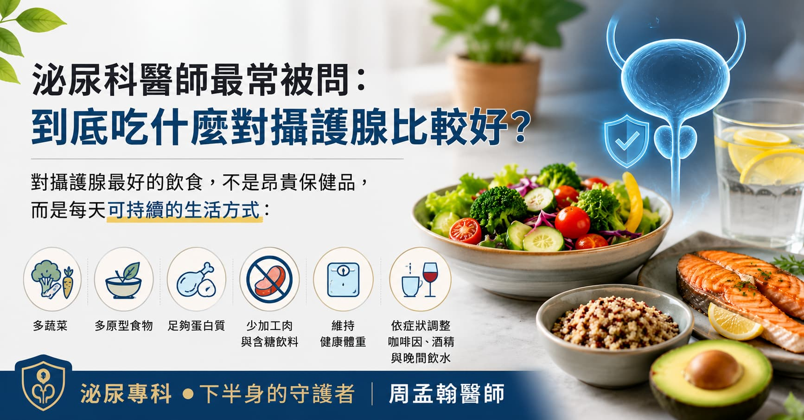

> **摘要：** 「吃什麼對攝護腺比較好？」是泌尿科門診最常被問的問題之一。答案不是單一神奇食物，而是長期飲食型態：維持健康體重、增加蔬菜水果與全穀豆類、以魚類與植物性蛋白取代過量紅肉及加工肉品，並依個人排尿症狀調整咖啡因、酒精與晚間飲水。飲食可以幫助降低整體健康風險、改善部分下尿路症狀，但不能取代 PSA 追蹤、肛門指診、影像檢查或必要治療。
> 本文由泌尿科專科醫師周孟翰依據攝護腺癌指南與臨床衛教原則，整理男性日常最實用的攝護腺飲食建議。

## 「醫師，我要不要多吃番茄？南瓜子有用嗎？」

「醫師，我最近夜尿變多，朋友叫我吃南瓜子。」\
「健檢 PSA 有點高，我是不是要開始吃茄紅素？」\
「爸爸有攝護腺癌，我想問到底吃什麼可以預防？」

這些問題在新店、大坪林、七張一帶的泌尿科門診非常常見。患者通常不是不重視健康，而是網路資訊太多：番茄、鋅、南瓜子、綠茶、豆漿、保健食品，每一種看起來都像答案。

但攝護腺健康不是靠某一顆膠囊決定。比較接近真相的是：**你的攝護腺，會受到體重、代謝狀態、發炎程度、排尿習慣與長期飲食型態共同影響。**

## 先講結論：沒有「保證顧攝護腺」的神奇食物

目前沒有任何單一食物或保健食品，被證實可以治療攝護腺肥大、讓 PSA 一定下降，或保證預防攝護腺癌。

這句話聽起來不夠神奇，但對患者最重要。因為真正有幫助的方向，通常不是「多吃某一種」，而是把日常飲食調整成比較抗發炎、能維持健康體重、也比較不刺激膀胱的型態。

可以把攝護腺飲食分成三個目標：

| 目標             | 飲食重點                   |
| -------------- | ---------------------- |
| **排尿症狀少一點**    | 減少晚間大量喝水、咖啡因、酒精與刺激性飲料  |
| **代謝與發炎風險低一點** | 控制體重，少吃高糖、高油、超加工食品     |
| **攝護腺癌風險管理**   | 多蔬果、全穀、豆類、魚類，少加工肉與過量紅肉 |

## 對攝護腺比較友善的飲食型態

### 1. 每天有足量蔬菜，尤其是十字花科蔬菜

蔬菜提供纖維、植化素與抗氧化營養素，也有助於體重控制。對攝護腺保養來說，重點不是只吃某一種菜，而是**顏色與種類要多**。

可優先放進餐盤的蔬菜包括：

* 花椰菜、青花菜、高麗菜、白蘿蔔等十字花科蔬菜
* 深綠色葉菜
* 菇類、番茄、甜椒、胡蘿蔔

簡單做法是：**每餐至少半碗到一碗蔬菜，一天累積 3 份以上**。外食族可以從便當多夾一份青菜、麵類加燙青菜開始。

### 2. 番茄可以吃，但不要把茄紅素當藥

番茄含有茄紅素（lycopene），是常被討論的攝護腺營養素。番茄、番茄糊、番茄湯都可以是健康飲食的一部分，尤其熟番茄搭配少量油脂，茄紅素吸收較好。

但要記得：**番茄是食物，不是攝護腺癌或攝護腺肥大的治療藥物。**

如果你喜歡番茄，可以放心把它放進日常菜單；但如果 PSA 升高、肛門指診異常、或有家族史，不應用「我最近有吃茄紅素」取代泌尿科評估。

### 3. 用魚類、豆類、雞蛋取代過量紅肉

高油脂紅肉、加工肉品與超加工食品，常伴隨較高熱量、飽和脂肪與鹽分。這些飲食型態容易讓體重、血糖、血脂往不好的方向走，而代謝症候群與肥胖也會影響排尿與攝護腺癌風險評估。

比較好的蛋白質選擇：

* 魚類：鮭魚、鯖魚、秋刀魚、虱目魚
* 豆製品：豆腐、豆干、無糖豆漿、毛豆
* 雞蛋、去皮雞肉
* 堅果少量作為點心

不需要完全不吃牛排或豬肉，但建議把加工肉品，如香腸、培根、火腿、熱狗，從「常常吃」改成「偶爾吃」。

### 4. 全穀與豆類，比精緻澱粉更適合熟齡男性

白飯、白麵包、甜點、含糖飲料容易讓血糖波動，也容易增加體重。對 50 歲後男性來說，體重與腰圍控制其實是攝護腺保養的重要基礎。

可以逐步替換成：

* 糙米、五穀飯、燕麥
* 地瓜、南瓜、玉米
* 紅豆、綠豆、鷹嘴豆、毛豆

目標不是完全戒澱粉，而是讓澱粉更有纖維、更有飽足感。

## 排尿困擾者要特別注意：喝什麼比吃什麼更有感

如果你的問題是頻尿、尿急、夜尿，飲食中最容易立刻影響症狀的，往往不是番茄或南瓜子，而是飲水時間與膀胱刺激物。

### 咖啡、茶、酒精：不是完全不能喝，但要看症狀

咖啡因有利尿與刺激膀胱的效果，酒精也可能讓夜尿變明顯。對於已經有攝護腺肥大、膀胱敏感或夜尿的患者，可以先做 2 週實驗：

* 下午 3 點後不喝咖啡、濃茶、能量飲料
* 晚餐後減少大量飲水
* 睡前 2–3 小時避免酒精與大量湯水
* 白天水分平均分配，不要忍到晚上才補

若夜尿明顯改善，就代表你的膀胱對這些刺激物很敏感。

### 辛辣食物不是每個人都要戒

辣椒、胡椒、酸性飲料對部分人會刺激膀胱或加重骨盆不適，但不是每位男性都會有影響。建議用「症狀日記」觀察：吃辣、喝酒、喝咖啡後 24 小時內，頻尿、尿急、會陰悶痛是否變明顯。

如果有明顯關聯，再限制才有意義。

## 乳製品、鈣片、維他命：別補過頭

許多患者會問：「牛奶會不會傷攝護腺？」目前研究對乳製品與攝護腺癌風險的結果並不完全一致，有些研究觀察到高乳製品或高鈣攝取與攝護腺癌風險可能相關，但證據不足以要求所有男性完全戒牛奶。

比較務實的建議是：

* 一般飲食中的牛奶、優格可以適量
* 不建議為了「顧骨頭」自行長期吃高劑量鈣片
* 有骨質疏鬆、腎結石、慢性腎臟病或正在接受攝護腺癌荷爾蒙治療者，補鈣與維生素 D 應由醫師評估

保健食品也是同樣原則。鋅、硒、維生素 E、南瓜子萃取、茄紅素膠囊都不是越多越好。尤其高劑量、長期、多種一起吃，可能造成肝腎負擔或與藥物交互作用。

## 攝護腺癌風險高的人，飲食之外更要做這件事

參考 2026 年 EAU 攝護腺癌指南，攝護腺癌的評估強調個人化風險，包括年齡、家族史、PSA、肛門指診、影像與共病狀況。飲食與健康狀態很重要，但不能取代早期偵測與風險分層。

以下族群建議更早與泌尿科醫師討論 PSA 追蹤：

* 50 歲以上男性
* 父親或兄弟曾罹患攝護腺癌
* PSA 曾偏高或逐年上升
* 肛門指診曾被告知有硬塊或不規則
* 已有明顯排尿困難、血尿、骨盆疼痛或不明原因骨痛

> 飲食做得再好，也不能用來「洗掉」異常 PSA。PSA 偏高時，應該確認是否有攝護腺肥大、發炎、近期射精或檢查干擾，必要時進一步安排影像或切片評估。

## 一天怎麼吃？攝護腺友善餐盤範例

### 早餐

* 無糖豆漿或低糖優格
* 燕麥、全麥吐司或地瓜
* 水煮蛋
* 一份水果

### 午餐

* 半碗到一碗糙米或五穀飯
* 一掌心魚肉、雞肉或豆腐
* 兩份蔬菜，其中一份可選青花菜或高麗菜
* 湯品適量，避免太鹹

### 晚餐

* 澱粉量比午餐略少
* 豆腐、魚類或雞蛋為主
* 多蔬菜，少油炸
* 若有夜尿，晚餐後避免大量湯水與酒精

### 點心

* 少量堅果、無糖優格、水果
* 避免含糖飲料、餅乾、洋芋片、宵夜泡麵

## 常見問題

### Q1：南瓜子真的對攝護腺好嗎？

A：南瓜子含有植物油脂、鎂、鋅等營養素，少量作為堅果類點心可以。但它不能縮小攝護腺，也不能取代攝護腺肥大藥物。若吃的是高鹽調味南瓜子，反而可能增加鈉攝取。

### Q2：豆漿會影響男性荷爾蒙嗎？

A：一般飲食量的豆漿、豆腐不會讓男性「女性化」。豆製品可以作為良好的植物性蛋白來源。真正要避免的是把豆類萃取物當成高劑量保健品長期大量服用。

### Q3：攝護腺肥大可以靠飲食改善嗎？

A：飲食與生活習慣可以減少膀胱刺激、改善夜尿與頻尿，但通常無法讓已經肥大的攝護腺明顯縮小。若有尿流變細、排尿費力、餘尿感或反覆尿滯留，仍需要泌尿科評估。

### Q4：PSA 偏高，吃茄紅素後再追蹤可以嗎？

A：不建議只靠保健食品等待。PSA 偏高需要先排除發炎、肥大、近期射精、檢查干擾等因素，再依年齡、家族史、攝護腺大小與 PSA 密度判斷是否需要 MRI 或切片。

## 守護者的叮嚀

對攝護腺最好的飲食，不是昂貴保健品，而是每天可持續的生活方式：**多蔬菜、多原型食物、足夠蛋白質、少加工肉與含糖飲料，維持健康體重，並依症狀調整咖啡因、酒精與晚間飲水。**

如果你已經有夜尿、頻尿、尿流變弱、PSA 偏高或家族史，飲食是加分項，但不是全部答案。該檢查的時候檢查，才是真正負責任的攝護腺保養。

> 📌 本文為衛教資訊，實際診斷與治療仍須由醫師依個人狀況評估。\
> **下半身的守護者｜周孟翰醫師**

## 參考資料

1. EAU-EANM-ESTRO-ESUR-ISUP-SIOG Guidelines on Prostate Cancer, 2026.
2. American Cancer Society. Can Prostate Cancer Be Prevented?
3. American Cancer Society Guideline for Diet and Physical Activity for Cancer Prevention.
4. Bradley CS, et al. Evidence for the Impact of Diet, Fluid Intake, Caffeine, Alcohol and Tobacco on Lower Urinary Tract Symptoms. Journal of Urology, 2017.
