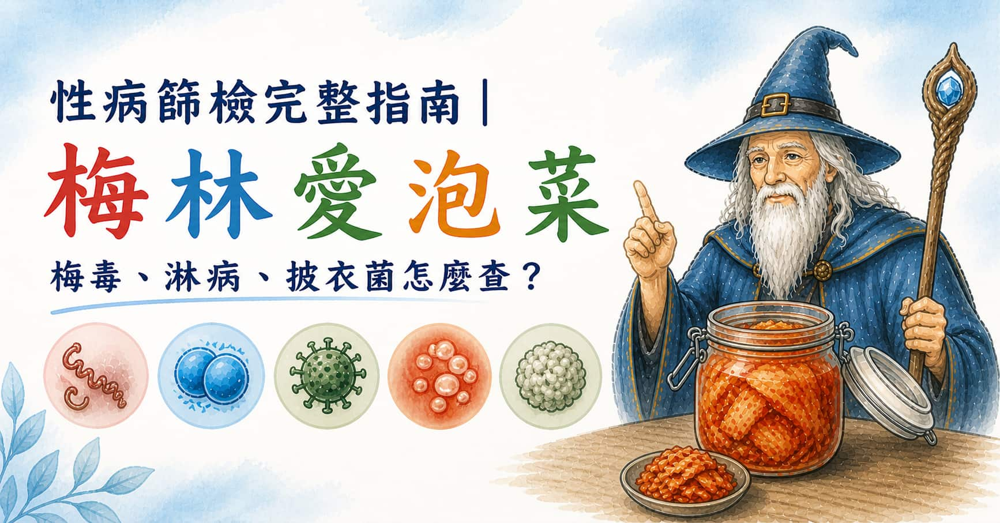

> **摘要：** 常見性傳染病（STI）包括梅毒（Syphilis）、淋病（Gonorrhea）、披衣菌（Chlamydia）及 HIV，多數早期感染無症狀。梅毒以血清學抗體檢測（VDRL/RPR + TPHA/FTA-ABS）為主，需注意窗口期（約 3–6 週）；淋病與披衣菌以核酸擴增檢測（NAAT/PCR）最敏感，採樣可用初段尿液或拭子；HIV 第四代抗原抗體複合檢測窗口期縮短至 18–45 天。梅毒以青黴素（Penicillin G）治療；淋病以頭孢曲松（Ceftriaxone）注射為主；披衣菌以阿奇黴素或多西環素治療，均可完全治癒。本文由泌尿科專科醫師周孟翰完整說明 STI 的篩檢流程與治療原則。

## 「我沒有症狀，應該沒問題吧？」

這是最危險的想法。

梅毒原發性感染的潰瘍（下疳）通常不痛、幾週後自動消失；披衣菌感染在男性中有超過 50%、女性中有高達 70–80% 是完全無症狀；HIV 急性感染期的症狀與感冒幾乎一樣，很快就消退。

**沒有症狀，不代表沒有感染。**&#x5B9A;期篩檢，是保護自己也保護伴侶的唯一方式。

## 四大主要性傳染病概覽

### 梅毒（Syphilis）

由梅毒螺旋體（*Treponema pallidum*）引起，分為四期：

| 分期        | 時間          | 主要表現                         |
| --------- | ----------- | ---------------------------- |
| **原發性梅毒** | 感染後 10–90 天 | 生殖器、肛門或口腔的無痛潰瘍（下疳），約 3–6 週自癒 |
| **繼發性梅毒** | 感染後 2–10 週  | 全身皮疹（包括手掌、腳掌）、淋巴結腫大、發燒       |
| **潛伏期**   | 繼發期後        | 無症狀，血液仍具傳染性                  |
| **三期梅毒**  | 未治療者，感染後數年  | 心臟、神經系統（神經性梅毒）、骨骼等嚴重病變       |

**篩檢方法：**

* **初步篩查**：VDRL 或 RPR（非梅毒螺旋體抗體）——快速、便宜，但可能假陽性
* **確認試驗**：TPHA 或 FTA-ABS（梅毒螺旋體特異性抗體）——確認診斷
* **窗口期**：最後暴露後 3–6 週（多數於 3 週後可偵測）

**治療：** 苄星青黴素 G（Benzathine Penicillin G）肌肉注射；青黴素過敏者可用多西環素替代。梅毒是可以完全治癒的疾病，早期治療效果更佳。

---

### 淋病（Gonorrhea）

由奈瑟氏淋球菌（*Neisseria gonorrhoeae*）引起，是台灣最常通報的性傳染病之一。

**症狀（感染後 2–7 天）：**

* **男性**：尿道分泌物（黃綠色膿性）、排尿灼熱疼痛、尿道口紅腫
* **女性**：多數無症狀；可能有陰道分泌物增加、骨盆腔疼痛
* **咽部 / 肛門感染**：多數無症狀，或喉嚨輕微不適

未治療的淋病可能上行感染，在女性造成骨盆腔炎（PID）甚至不孕；男性可造成附睾炎。

**篩檢方法：**

* **核酸擴增檢測（NAAT/PCR）**：最敏感，可用初段尿液（前 20 mL）、尿道拭子、陰道拭子或咽喉、直腸拭子
* 採尿前建議停止排尿 **至少 2 小時**
* **窗口期**：暴露後 1–2 週

**治療：** 頭孢曲松（Ceftriaxone 500 mg）單次肌肉注射，同時合併治療披衣菌（因兩者常共同感染）。全球淋菌的抗藥性問題日益嚴重，務必完成療程並確認治癒。

---

### 披衣菌感染（Chlamydia）

由沙眼披衣菌（*Chlamydia trachomatis*）引起，是全球最常見的細菌性性傳染病。

**最大特點：沉默感染**

男性約 50%、女性約 70–80% 的感染者**完全無症狀**。有症狀者可能出現：

* 男性：尿道輕微分泌物（白色或透明）、輕微排尿不適
* 女性：白帶增加、輕微骨盆疼痛、性交後出血

長期未治療的披衣菌感染，是女性骨盆腔炎與不孕的主要原因之一，男性可造成附睾炎。

**篩檢方法：**

* **NAAT/PCR**：與淋病相同，可用同一份樣本同時檢測兩者
* **窗口期**：暴露後 1–2 週（多數 7–14 天）

**治療：** 阿奇黴素（Azithromycin 1g 單劑）或多西環素（Doxycycline 100 mg，7 天療程）。治療後 3 個月建議重新篩檢（再感染率高）。

---

### HIV

HIV 的篩檢屬於重要的健康管理，詳細說明請參閱[如何透過藥物預防性傳染病（PrEP/PEP）](/blog/std-medication-prevention)。

**篩檢方法重點：**

* **第四代複合檢測（Combo Test）**：同時偵測 HIV 抗原（p24）與抗體，窗口期縮短至 **18–45 天**（傳統抗體測試需 6–12 週）
* 高風險行為後 45 天可進行第四代篩檢，結果陰性且無新暴露，準確性高

---

## 何時應該篩檢？

### 依高風險暴露評估

| 情境            | 建議篩檢頻率                        |
| ------------- | ----------------------------- |
| 有新的性伴侶（無保護措施） | 每次暴露後 2–4 週篩檢                 |
| 多重性伴侶         | 每 3–6 個月定期篩檢                  |
| 使用 PrEP 中     | 每 1.5–3 個月（HIV + 梅毒 + 淋病/披衣菌） |
| 疑似暴露後（72 小時內） | 立即諮詢 PEP，並在窗口期後篩檢             |
| 伴侶確認感染        | 立即就醫篩檢                        |

### 症狀出現時

以下症狀出現，應立即就診：

* 生殖器或肛門周圍出現潰瘍、水泡、疣狀突起
* 尿道分泌物（任何顏色、任何量）
* 排尿時灼熱感或疼痛
* 腹股溝淋巴結無痛性腫大
* 全身出現皮疹（尤其手掌、腳掌）

## 篩檢的完整流程

1. **就診諮詢**：說明暴露類型、時間與症狀，醫師評估篩檢項目
2. **採樣**：依暴露部位採集尿液、血液或拭子（尿道、咽喉、直腸、陰道）
3. **等待結果**：血液梅毒 / HIV 通常 1–3 個工作天；PCR 通常 3–5 個工作天
4. **結果解讀**：由醫師說明結果，陽性者安排治療，陰性者討論是否需在空窗期後重複
5. **性伴侶通知**：若確診，建議告知近期性伴侶一同篩檢與治療（Partner Notification）

## 在新店如何進行低調篩檢？

性傳染病篩檢需要隱私與尊重的環境。**新店高美泌尿科診所**提供：

* 獨立診間，確保諮詢過程的隱私
* 由泌尿科專科醫師（周孟翰醫師）親自評估，不委由助理
* 同一次門診可完成問診、採樣與開立用藥，無需多次往返
* 診所位於**大坪林捷運站**附近（步行約1分鐘的距離），鄰近新店、景美、永和、中和等地區，就診方便

若你有過無保護性行為、或擔心自己可能有感染風險，不需要等到症狀出現才就醫。**主動篩檢，是負責任的選擇**。

## 常見問題

**Q：如果確診梅毒，要通報嗎？**

梅毒屬於法定傳染病，醫療院所會向衛生機關通報病例（不含個人隱私資料）。但這不會影響你的日常生活，也不會主動告知你的雇主或家人。

**Q：篩檢後治療了，還需要追蹤嗎？**

是的。梅毒治療後需在 3、6、12 個月追蹤 VDRL/RPR 滴度確認下降；淋病和披衣菌治療後建議 3 個月後重新篩檢（因再感染率較高）。

**Q：使用保險套是否就完全安全？**

保險套可以顯著降低淋病、披衣菌、HIV 的傳染風險（有效率約 70–90%），但無法完全阻絕梅毒和 HSV（皰疹）的接觸傳播（因為這兩者可能存在保險套未覆蓋的皮膚區域）。**定期篩檢**仍然重要，即使一向使用保險套。
