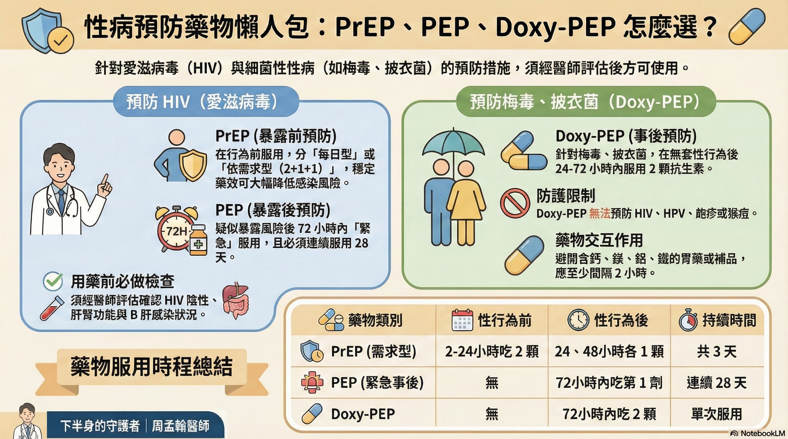

## 目前常見可分為三大策略：

* HIV 的**暴露前預防**（PrEP）
* HIV 的**暴露後預防**（PEP）
* 細菌性性病的**暴露後預防**（Doxy-PEP）

## 一、HIV 暴露前預防性投藥（PrEP）

### 1. 什麼是 PrEP？

PrEP（Pre-Exposure Prophylaxis）是指在尚未感染 HIV 的情況下，規律服用藥物，讓體內維持足夠藥物濃度，以降低因性行為感染 HIV 的風險。

PrEP 的保護效果與服藥遵囑性密切相關；漏服會明顯降低保護力。

### 2. 使用對象與藥物選擇

* **適用對象**：持續存在感染風險行為（如多重性伴侶、未固定使用保險套等），且 HIV 篩檢為陰性者。
* **常用藥物**：得諾恩（Tenoem）或舒發泰（Truvada）。
* **限制條件**：嚴重肝功能異常者不可使用；腎功能（CrCl）低於 60 ml/min 者，不建議使用 TDF/FTC 類藥物。

### 3. 服用方式與時間軸

#### 每日服用型（Daily PrEP）

* **頻率**：每天固定 1 顆。
* **生效時間**：持續服用約 7 天後保護力較完整（男性約滿 48 小時可達基本保護力）。
* **停藥原則**：男性需在最後一次性行為後續服 2 劑；女性通常需持續使用 7 天後再停藥。

#### 依需求服用型（On-demand / 2+1+1）

* **適用對象**：僅適用於男男性行為者（MSM）及跨性別女性，且 B 肝篩檢須為陰性。
* **投藥方式**：
  * 性行為前 2–24 小時：2 顆
  * 性行為後 24 小時：1 顆
  * 性行為後 48 小時：1 顆

### 4. 潛在副作用

常見為頭痛、噁心、腸胃不適、疲倦無力。

## 二、HIV 暴露後預防性投藥（PEP）

### 1. 什麼是 PEP？

PEP（Post-Exposure Prophylaxis）是疑似暴露於 HIV 風險後的「緊急預防」措施，例如不安全性行為或遭受性侵害後。

### 2. 關鍵時間與療程

* **黃金時間**：暴露後 72 小時內儘速服用第一劑，愈早愈好。
* **最晚時限**：一般不建議超過一週才啟動。
* **療程長度**：連續服用 28 天，每日 1 次，不可中斷。

### 3. 常用藥物與追蹤

* **常用藥物**：三合一複方藥錠，如吉他韋（Biktarvy）。
* **後續追蹤**：療程結束後，需於 6 週、3 個月（必要時至 6 個月）追蹤 HIV 與其他性病檢測。

### 4. 潛在副作用

常見為頭痛、噁心、失眠。

## 三、細菌性性病事後預防（Doxy-PEP）

### 1. 什麼是 Doxy-PEP？

Doxy-PEP 是在無套性行為後，使用抗生素強力黴素（doxycycline）作為事後預防，以降低細菌性性病風險。

* **可預防**：梅毒、披衣菌、部分淋病。
* **不能預防**：HIV、HPV、皰疹、mpox（猴痘）。

### 2. 服用方式

* **適用對象**：主要為男男同性、雙性戀男性、跨性別女性；部分異性戀男性可由醫師個別評估。
* **服用時機**：性行為後 24 小時內效果最佳，最遲不超過 72 小時。
* **建議劑量**：單次 200 mg（常見為 100 mg × 2 顆）。
* **頻率限制**：24 小時內總劑量不可超過 200 mg。

### 3. 潛在副作用

常見為腸胃不適、食道炎、光敏感、食慾下降。

## 四、重要注意事項（共同規範）

* **用藥前檢查**：需先由醫師評估與抽血，確認 HIV 狀態、肝腎功能與 B 型肝炎狀況。
* **B 肝監測**：若合併 B 肝感染，中斷部分預防藥物可能造成急性惡化，需由醫師密切監測肝功能。
* **副作用管理**：腹瀉、噁心、頭痛、疲倦等副作用通常在服藥初期較明顯，多在一個月內改善。
* **藥物交互作用**：避免與含鈣、鎂、鋁、鐵之制酸劑或補充劑同時服用，建議至少間隔 2 小時以上，以免影響吸收。
* **定期篩檢**：無論採取哪種預防策略，皆建議每 3–6 個月進行完整 HIV 與性病檢測。

## 守護者的叮嚀

藥物預防是降低感染風險的重要工具，但必須在正確評估、正確時機、正確劑量下使用，才能真正發揮效果。

若您有相關需求，建議與醫師討論個人風險與最適方案，搭配規律追蹤，才能兼顧保護力與用藥安全。

> 📌 本貼文為衛教資訊，實際診斷與治療須由醫師仔細評估\
> **下半身的守護者｜周孟翰醫師**
