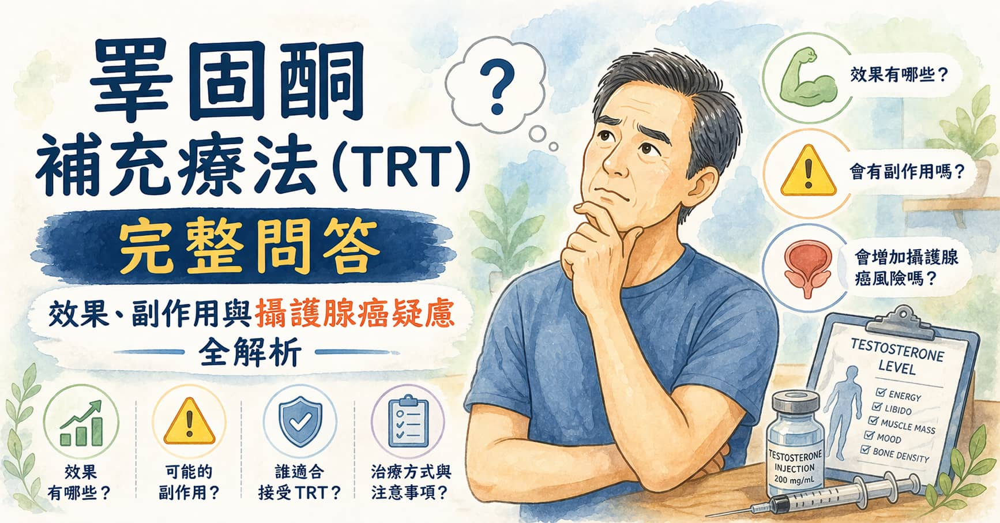
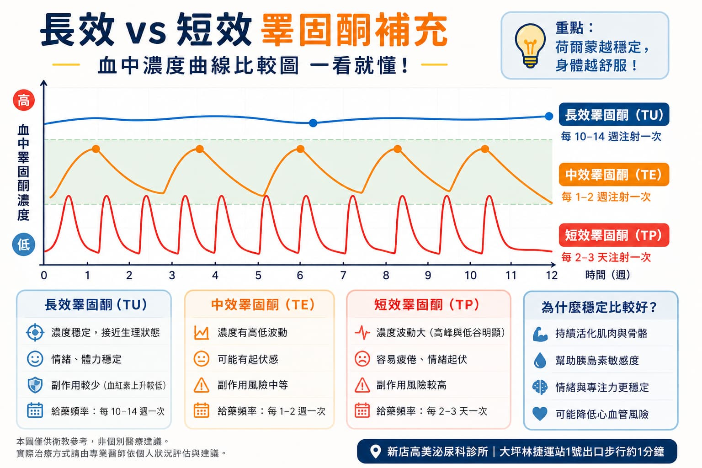

> **摘要：** 睪固酮補充療法（Testosterone Replacement Therapy, TRT）適用於有症狀且血清睪固酮確認低下（\< 350 ng/dL）的男性性腺功能低下症（Hypogonadism）患者，可改善性慾、勃起功能、體力、情緒及骨密度。主要副作用包括紅血球增多症（需定期監測血球比容）、暫時性不孕及生殖腺萎縮。TRT 不會「導致」攝護腺癌；但已確診攝護腺癌者為禁忌症。 本文由泌尿科專科醫師周孟翰說明 TRT 的適應症、各劑型比較、副作用管理，以及 TRT 與攝護腺癌風險的正確認識。

## 「我是不是需要補充荷爾蒙？」

「醫師，我最近半年特別容易累，性慾也降很多，晨勃幾乎消失，而且整個人很悶，感覺不像以前的自己。」\
「我有聽說可以補充男性荷爾蒙，但又擔心補了會得攝護腺癌。」

這段對話幾乎每個月在門診都會出現，通常發生在 45 歲以上的男性身上，近期也有越來越多 35–45 歲的族群開始注意到類似症狀。

睪固酮低下（睪固酮缺乏症）不是單純的「老化正常現象」。症狀影響生活品質時，正確的評估與治療可以讓人有顯著的改善感受。但在考慮 TRT 之前，有幾件事需要先弄清楚。

## 什麼是睪固酮？正常值是多少？

睪固酮（Testosterone）是最主要的男性荷爾蒙，由睪丸的萊氏細胞（Leydig Cells）分泌。它在男性的功能涵蓋：

* 維持性慾（Libido）與勃起功能
* 維持肌肉量與骨密度
* 促進紅血球生成
* 影響情緒、認知功能與活力
* 體毛與第二性徵維持

**血清睪固酮正常範圍：** 350–1000 ng/d&#x4C;**（各實驗室略有差異）**

* **\< 350 ng/dL**：符合睪固酮低下診斷門檻（需兩次清晨空腹抽血確認）
* 清晨 7–10 點抽血最準確（睪固酮在這段時間最高）

## 睪固酮低下的症狀

睪固酮低下的症狀可能與憂鬱症、甲狀腺功能低下、過度疲勞等狀況高度重疊，需搭配血液檢查才能確認：

**典型症狀：**

* **性慾降低**，對性行為失去興趣
* **勃起功能障礙**，特別是晨勃消失
* **持續疲倦感**，即使充足睡眠後仍然如此
* **情緒低落、易怒或煩躁**
* **難以集中注意力**（腦霧感）

**身體組成變化：**

* 肌肉量減少，體脂肪增加（尤其腹部脂肪）
* 骨密度下降（長期低下可能增加骨折風險）
* 體毛減少
* 貧血傾向

## TRT 適合誰？評估流程

並非所有「感覺累」的男性都需要 TRT。補充前的評估步驟：

### 第一步：確認症狀與血液檢查

* **血清總睪固酮（Total Testosterone）**：兩次清晨空腹測值 \< 350 ng/dL
* **游離睪固酮（Free Testosterone）**：若總睪固酮介於 300–400 ng/dL 但症狀明顯，游離睪固酮偏低也支持診斷
* **LH、FSH**：判斷問題源自睪丸（原發性）還是腦垂體（繼發性）
* 排除其他原因：甲狀腺功能、泌乳激素、血糖

### 第二步：排除禁忌症

以下情況**不建議**使用 TRT：

* 已確診或高度懷疑**攝護腺癌**
* **乳癌**（男性少見但存在）
* **嚴重紅血球增多症**（血球比容 > 54%）
* **未控制的嚴重睡眠呼吸中止症**
* 計畫近期**生育**（TRT 會抑制精子生成，欲生育者另有替代方案）
* **嚴重心衰竭**（液體滯留風險）

## TRT 有哪些劑型？

| 劑型                 | 使用方式          | 優點          | 缺點                   |
| ------------------ | ------------- | ----------- | -------------------- |
| **肌肉注射針劑**         | 每 1–4 週注射一次   | 作用確實、不需每日用藥 | 注射後濃度波動較大；需回診或自行注射   |
| **長效針劑（Nebido®）**  | 每 10–14 週注射一次 | 濃度穩定、回診頻率低  | 起效較慢                 |
| **外用凝膠（Gel）**      | 每日塗抹於肩膀或大腿    | 濃度穩定、無需注射   | 每日使用、接觸傳播風險（需避免皮膚接觸） |
| **皮膚貼片**           | 每日更換          | 使用簡便        | 部分患者皮膚過敏             |
| **口服製劑（Andriol®）** | 每日 2–3 次      | 無需注射        | 生物利用率低，效果較不穩定        |

台灣目前最常用的是**肌肉注射（短效或長效）與外用凝膠**兩種，建議與醫師討論最適合個人生活型態的劑型。(附圖比較不同成分針劑所呈現的濃度曲線比較圖)\

## TRT 可以帶來哪些改善？

開始 TRT 後，改善出現的時間因症狀而異：

| 改善項目      | 預期出現時間          |
| --------- | --------------- |
| 性慾提升      | 3–6 週           |
| 勃起功能改善    | 3–6 個月          |
| 體力與活力增加   | 3–6 週           |
| 情緒穩定、煩躁減少 | 3–6 週           |
| 肌肉量增加     | 3–6 個月（需配合運動）   |
| 骨密度改善     | 6 個月–1 年（需長期治療） |

TRT 的效果因人而異，**需要搭配合理的運動與生活型態調整**，才能達到最佳效果。

## TRT 的副作用——如何監測與管理

### 主要副作用

**紅血球增多症（Erythrocytosis）**

TRT 會刺激紅血球生成，使血球比容（Hematocrit）升高。若超過 54%，血液黏稠度增加，有血栓風險，需暫停或減量。

→ **監測方式**：治療開始後 3、6、12 個月定期抽血檢查血球比容

**暫時性不孕**

TRT 透過負回饋抑制腦垂體，使 LH 和 FSH 下降，導致睪丸內睪固酮降低，**精子生成減少甚至停止**。停止 TRT 後，多數患者的精子生成在 6–12 個月內恢復，但不保證完全恢復。

→ **有生育需求者**：可評估改用促性腺激素（如 HCG）刺激睪丸，在提升睪固酮的同時保留生育能力

**睪丸萎縮**

因外源性睪固酮抑制自然分泌，睪丸體積可能縮小 10–20%，通常不影響功能，停藥後可部分恢復。

**皮膚油脂增加與痤瘡**

類似青春期荷爾蒙變化，多數患者症狀輕微。

**乳腺組織增生（Gynecomastia）**

睪固酮在體內可被芳香化酶轉化為雌激素，部分男性出現輕度女性化乳房。可透過選擇性芳香化酶抑制劑或調整劑量處理。

### 定期監測計畫

| 監測項目        | 時間點       |
| ----------- | --------- |
| 血清睪固酮       | 每 3–6 個月  |
| 血球比容（CBC）   | 每 3–6 個月  |
| PSA 攝護腺特異抗原 | 每 6–12 個月 |
| 血脂與血糖       | 每年        |
| 直腸指診（DRE）   | 每年        |

## 最多人擔心的問題：TRT 會不會導致攝護腺癌？

這是幾乎每一位考慮 TRT 的患者都會問的問題，也是過去幾十年間醫學界持續討論的重要議題。

**舊觀念（已被推翻）**：1940 年代 Huggins 與 Hodges 的研究顯示，去除睪丸可使攝護腺癌退縮，因此推論睪固酮是攝護腺癌的「燃料」，長達數十年的教科書都告知「TRT 增加攝護腺癌風險」。

**現代醫學共識（飽和模型，Saturation Model）**：

Morgentaler 等學者在 2000 年代後期提出「飽和模型」，得到大量研究支持：

* 攝護腺的雄性激素受體在**相對低的睪固酮濃度下即達到飽和**（約 250 ng/dL）
* 在飽和點以上，繼續升高睪固酮對攝護腺細胞生長的刺激**幾乎沒有額外效應**
* 多項大型研究顯示，接受 TRT 的男性，攝護腺癌發生率**並不高於**未接受治療者

**重要的臨床共識（2025 年 EAU / AUA 指引）：**

* TRT 不會導致正常男性罹患攝護腺癌
* 對於**低風險攝護腺癌已接受根治性治療且持續追蹤無復發**的患者，在充分知情同意下，TRT 在嚴格監測下被認為是可討論的選項（此為特殊情況，需個案評估）
* **活動性攝護腺癌或近期治療後未確認完全緩解者：仍為 TRT 絕對禁忌症**

因此，「補充睪固酮就會得攝護腺癌」是需要被更正的觀念。但這不代表 TRT 沒有任何風險——它需要定期監測 PSA，並排除既有的攝護腺癌。

## TRT 不是萬能的——需要同步處理的問題

TRT 改善的是**荷爾蒙本身不足**所造成的症狀。以下情況 TRT 可能效果有限：

* 勃起功能障礙主要源自**血管問題**（如高血壓、糖尿病、動脈硬化）——需同步治療心血管風險
* 睡眠呼吸中止症（TRT 可能加重）——需先評估並治療
* 憂鬱症和焦慮症——心理治療或抗憂鬱藥可能更直接有效

## 什麼情況應該就醫評估？

| 情況                   | 建議                  |
| -------------------- | ------------------- |
| 持續疲倦、性慾下降、晨勃消失 ≥3 個月 | 泌尿科門診，抽血確認睪固酮       |
| 不明原因的情緒低落、肌肉流失       | 排除其他疾病後評估荷爾蒙        |
| 已在使用 TRT，但效果不明顯或有副作用 | 回診調整劑型或劑量           |
| 計畫近期生育但有低睪固酮症狀       | 討論 HCG 等替代方案，保留生育能力 |

## 周醫師的提醒

睪固酮補充療法不是「抗老逆齡神藥」，也不是洪水猛獸。它是一個適應症明確、需要評估和監測的醫療介入。

正確的做法是：先確認症狀符合、血液數值確認低下、排除禁忌症——然後在醫師監測下進行，定期追蹤血球與 PSA。對於適合的患者，TRT 確實能帶來生活品質上的顯著改善。

如果你在新店(如大坪林、七張)、景美、永和、中和及深坑等地一帶有相關困擾，或健檢報告顯示睪固酮偏低，歡迎到新店高美泌尿科診所預約，讓周孟翰醫師進行完整的荷爾蒙評估。
