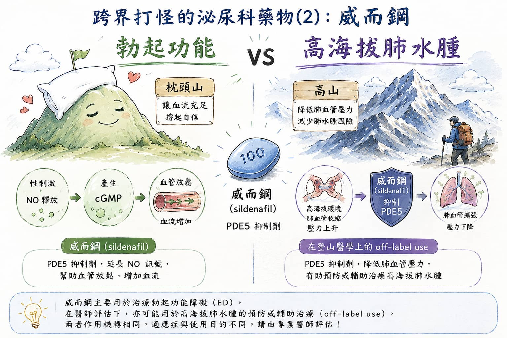

> **摘要：** 威而鋼（sildenafil）是泌尿科常見的勃起功能障礙（ED）治療藥物，屬於 PDE5 抑制劑，在台灣是性功能治療的自費處方藥。它的主要作用是延長一氧化氮（NO）訊號，幫助陰莖海綿體血管放鬆、增加血流；同一個機轉也會影響肺血管壓力，因此在登山醫學中被討論用於高海拔肺水腫（HAPE）的預防或輔助治療。本文由泌尿科專科醫師周孟翰說明威而鋼的 ED 機轉、HAPE 的 off-label use、常見劑量與注意事項。

## 跨界打怪的泌尿科藥物：從枕頭山到高山

「醫師，我聽說威而鋼除了幫助勃起，也可以預防高山症？」\
「下個月要去高海拔健行，能不能先買幾顆威而鋼備著？」

這類問題在新店、大坪林、七張、景美、木柵一帶的泌尿科門診不算少見。許多男性原本是因為性功能問題來諮詢，聊著聊著才發現自己也有登山、滑雪、海外健行或高海拔旅遊計畫。

但要先釐清：**威而鋼的主要治療角色是勃起功能障礙，不是一般登山前自行準備的預防用藥。** 在台灣，sildenafil 用於高海拔肺水腫預防或治療，並不是藥品仿單明確標示的核准適應症，屬於 **off-label use（仿單標示外使用）**。這代表臨床上即使有研究與指引討論，仍需要醫師依照個人風險、共病與行程安排判斷。\

## 威而鋼治療勃起功能障礙的機轉

正常勃起不是「意志力開關」，而是一連串神經、血管與海綿體平滑肌協調的結果。性刺激出現後，陰莖神經與血管內皮會釋放一氧化氮（NO），讓 cGMP 增加，海綿體平滑肌放鬆，血液大量流入陰莖。

可以把陰莖海綿體想像成一座可充水的水壩：

* 性刺激像是打開進水閘門
* NO/cGMP 訊號像是讓閘門保持開啟的控制系統
* PDE5 則像是負責把控制訊號關掉的清除工
* Sildenafil 抑制 PDE5，就像暫時讓清除工慢一點下班，讓進水訊號維持久一些

所以威而鋼不是「憑空製造慾望」的藥，也不是吃了就會自動勃起。它需要有性刺激，才能幫助血流進入海綿體，改善硬度與維持時間。

### 在台灣是性功能治療的自費用藥

在台灣，威而鋼與多數 sildenafil 學名藥主要用於成年男性勃起功能障礙治療，通常屬於自費處方藥。一般建議在性行為前 1 小時服用。

實際劑量會受到年齡、肝腎功能、心血管狀況、正在服用的藥物與副作用耐受度影響。若只是自行從網路購買不明來源藥物，風險不只是假藥，也可能錯過糖尿病、高血壓、血脂異常、睪固酮低下等真正造成 ED 的原因。

## 高海拔肺水腫是什麼？

高海拔肺水腫（High-Altitude Pulmonary Edema, HAPE）是高海拔環境中最危險的急症之一，通常發生在快速上升到高海拔後的 2–5 天。它不是單純喘或體力差，而是肺部血管壓力上升，導致液體滲入肺泡，使氧氣交換變差。

常見警訊包括：

* 休息時也喘
* 咳嗽加劇，可能有粉紅色泡沫痰
* 胸悶、極度疲倦
* 走路速度明顯變慢
* 嘴唇發紫、血氧下降
* 夜間呼吸困難或無法平躺

HAPE 的第一線處置永遠是：**下降高度、給氧、保暖、停止活動**。如果無法立刻下降，才會考慮攜帶式加壓艙與藥物輔助。威而鋼在這裡不是「登山神藥」，而是特定情境下可能被討論的輔助選項。

## 為什麼威而鋼會被拿來談高海拔肺水腫？

人在高海拔缺氧時，肺血管會收縮，這本來是身體重新分配血流的保護反應。但有些人的肺血管收縮過度且不均勻，肺動脈壓大幅上升，局部微血管承受太大壓力，就可能像水管壓力過高一樣開始滲水，形成肺水腫。

Sildenafil 的 PDE5 抑制效果不只存在於陰莖海綿體，也會影響肺血管。它可以延長 NO-cGMP 訊號，讓肺血管較放鬆，降低肺動脈壓。用比喻來說：

* ED 治療：讓陰莖海綿體的「進水通道」比較容易打開
* HAPE 預防：讓肺血管的「高壓管線」不要那麼緊繃

同一個藥物，因為作用在不同血管床，就有了不同臨床討論場景。

## HAPE 預防或治療時的效果與劑量

登山醫學指引中，HAPE 預防最重要的策略仍是**慢慢上升、安排適應日、避免過度衝刺、出現症狀就停止上升**。藥物通常保留給高風險者，例如過去曾發生 HAPE、必須快速上升、或無法安排足夠適應時間的人。

在國際登山醫學資料中，sildenafil 曾被列為 HAPE 預防的 off-label 選項之一，常見成人劑量為：

| 使用情境           | 常見劑量頻次                    | 重點提醒                  |
| -------------- | ------------------------- | --------------------- |
| HAPE 高風險者預防    | Sildenafil 50 mg，每 8 小時一次 | 屬 off-label use，需醫師評估 |
| 另一種 PDE5 抑制劑選項 | Tadalafil 10 mg，每日 2 次    | 半衰期較長，仍需醫師評估          |
| HAPE 治療輔助      | 以下降高度與氧氣為主，藥物僅作輔助         | 不可用藥物取代下降高度           |

要特別注意，這裡談的是高風險登山或高海拔旅遊的醫療規劃，不是一般人出發前自行買藥「有吃有保佑」。對多數登山者而言，正確爬升速度與早期辨識症狀，比帶一堆藥更重要。

## Off-label use：仿單標示外使用是什麼意思？

**Off-label use（仿單標示外使用）** 指的是藥物被用在仿單未明確列出的適應症、族群、劑量或使用方式。這不等於違法或一定不安全，臨床上有些 off-label use 是基於研究、指引與專科經驗；但它也不等於「網路看到就可以自己吃」。

以威而鋼為例：

| 用途            | 在台灣的定位                     |
| ------------- | -------------------------- |
| 勃起功能障礙        | 藥品仿單標示用途，性功能治療自費處方藥        |
| 高海拔肺水腫預防或治療輔助 | **Off-label use（仿單標示外使用）** |

因此，如果要為高海拔行程討論 sildenafil，應該和醫師確認：是否真的屬於 HAPE 高風險、是否有禁忌症、是否需要其他藥物、行程是否需要調整，以及發生症狀時的撤退計畫。

## 威而鋼的副作用與注意事項

Sildenafil 常見副作用多與血管擴張有關：

| 副作用     | 可能表現           | 建議處理方式            |
| ------- | -------------- | ----------------- |
| 頭痛、臉潮紅  | 臉熱、頭脹、微微心悸     | 多數短暫，若嚴重需停用並就醫    |
| 鼻塞、胃灼熱  | 鼻子悶、消化不良       | 可與醫師討論劑量或服藥時間     |
| 頭暈、低血壓  | 站起來暈、虛弱        | 避免酒精與脫水，高海拔行程更需小心 |
| 視覺異常    | 視覺偏藍、畏光、模糊     | 若持續或嚴重應就醫         |
| 勃起過久    | 勃起超過 4 小時      | 需急診處理             |
| 胸痛或呼吸困難 | 可能是心血管問題或高海拔急症 | 不可自行追加藥物，應立即就醫或撤退 |

### 絕對不能一起使用的藥物

以下藥物與 sildenafil 併用可能造成危險性低血壓：

* **硝酸鹽類藥物**：如硝化甘油舌下錠、硝化甘油貼片、isosorbide 類藥物
* **Riociguat**：肺高壓藥物
* 來路不明的壯陽藥或混合成分產品

若有心絞痛病史、近期心肌梗塞或中風、嚴重心律不整、低血壓、嚴重肝腎功能異常，或正在使用 alpha-blocker、降血壓藥、抗病毒藥、抗黴菌藥，使用前都應由醫師評估。

## 新店、文山區男性就醫時，泌尿科門診會怎麼評估？

如果你住在新店、大坪林、七張、安坑，或文山區景美、木柵、萬芳一帶，想討論威而鋼或勃起功能障礙，泌尿科門診時通常會從以下幾個方向一起了解：

| 想討論的問題   | 建議評估的內容                         |
| -------- | ------------------------------- |
| 勃起功能障礙   | 發生多久、硬度、晨勃、性慾、是否有糖尿病或高血壓        |
| 用藥安全     | 是否使用硝酸鹽、降血壓藥、alpha-blocker 或心臟藥 |
| 心血管與代謝風險 | 胸痛、喘、心臟病史、糖尿病、高血壓、血脂異常          |
| 男性荷爾蒙狀態  | 性慾、疲倦、晨勃變化，必要時評估睪固酮             |
| 生活型態因素   | 壓力、睡眠、抽菸、飲酒、運動量與體重              |

泌尿科的價值不只是開一顆藥，而是把性功能、心血管風險、男性荷爾蒙與用藥交互作用一起看。尤其大台北地區許多患者工作忙、壓力大，勃起功能障礙有時也可能是血管健康的早期警訊，安全用藥比「藥效強不強」更重要。

至於高海拔旅遊、登山行程安排、高山症或高海拔肺水腫風險評估，**建議另外諮詢旅遊醫學門診或家醫科**，並依行程海拔、上升速度、過去高山症病史與撤退資源做完整規劃。

## 周醫師的提醒

威而鋼是一個很適合拿來談「跨界打怪」的藥物：在泌尿科，它幫助勃起功能障礙患者改善海綿體血流；在登山醫學中，它則因為能降低肺動脈壓，被討論用於高海拔肺水腫的預防或輔助治療。

但這兩件事不能混為一談。**ED 治療是威而鋼在台灣主要的仿單標示用途；高海拔肺水腫則屬於 off-label use（仿單標示外使用）**，而且真正遇到 HAPE 時，最重要的仍是下降高度、給氧與緊急處置。

如果你在新店、大坪林、七張、安坑或文山區景美、木柵一帶，正在考慮使用威而鋼，或有勃起功能障礙與性功能用藥安全的疑問，歡迎到新店高美泌尿科診所諮詢，由周孟翰醫師進行完整評估。

> 📌 本文介紹藥物機轉與臨床討論僅作為衛教資訊，並非個人化臨床建議；實際是否使用 sildenafil 預防或治療高海拔肺水腫，仍須由相關專科醫師依個人狀況評估。\
> **下半身的守護者｜周孟翰醫師**

\#周孟翰醫師 #下半身的守護者 #威而鋼 #威爾鋼 #Sildenafil #西地那非 #勃起功能障礙 #高海拔肺水腫 #HAPE #登山醫學 #新店泌尿科 #文山區泌尿科 #大坪林泌尿科 #新店高美泌尿科 #台北泌尿科
