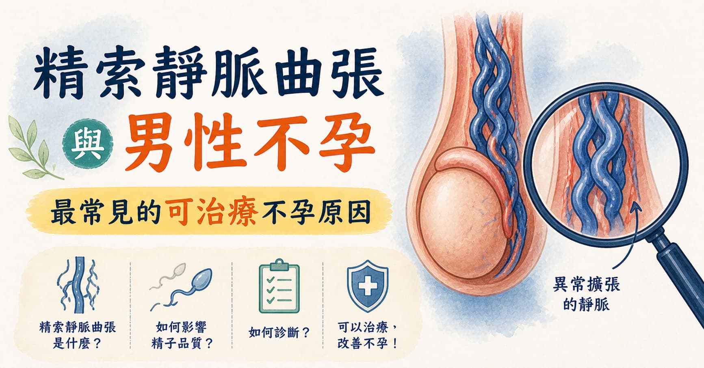

> **摘要：** 精索靜脈曲張（Varicocele）是睪丸周圍的靜脈叢（蔓狀靜脈叢）異常擴張，好發於左側，影響約 15% 的一般男性，在不孕症男性中比例高達 35–40%，是男性不孕最常見的可治療原因。其對生育的傷害主要來自溫度調節失常、氧化壓力升高與睪固酮下降，表現在精液分析異常（精子數量減少、活動力下降、形態異常）。顯微鏡精索靜脈結紮術是目前治療效果最佳的手術方式。本文由泌尿科專科醫師周孟翰說明精索靜脈曲張的診斷、對生育的影響與手術治療選項。

## 「備孕一年多，精液報告說精子數量很少……」

「醫師，我太太都沒問題，但我的精液報告說精子濃度很低，活動力也不好。怎麼辦？」

「醫師幫我做了睪丸超音波，說左邊有精索靜脈曲張，這就是原因嗎？手術後精子會變好嗎？」

男性因素在不孕症中佔了約 50% 的比例，而精索靜脈曲張是其中最常見、也最可以透過治療改善的原因。問題在於，許多男性直到備孕才第一次做精液檢查，而精索靜脈曲張本身往往毫無症狀，更容易被忽視。

## 什麼是精索靜脈曲張？

精索靜脈曲張是精索內的靜脈叢（蔓狀靜脈叢，Pampiniform Plexus）發生異常擴張，類似腿部靜脈曲張。

**為什麼左側比右側常見？**

* 左側精索靜脈以直角匯入左腎靜脈，血液回流阻力較大，容易造成靜脈壓力升高
* 右側精索靜脈以斜角匯入下腔靜脈，阻力相對較小
* 臨床上約 90% 的精索靜脈曲張發生於左側；雙側約佔 15–20%

**WHO 分級：**

| 等級          | 定義                         |
| ----------- | -------------------------- |
| 亞臨床型        | 理學檢查無法發現，只有超音波才能偵測到        |
| **第 I 級**   | 只在 Valsalva 操作（用力憋氣）時才能觸診到 |
| **第 II 級**  | 站立時可以直接觸診到，不需 Valsalva     |
| **第 III 級** | 站立時肉眼即可看到明顯曲張靜脈            |

臨床上第 II–III 級較易影響精子品質，但亞臨床型和第 I 級是否需要治療，需依精液分析結果與生育需求綜合評估。

## 精索靜脈曲張如何影響生育？

睪丸溫度正常應比體溫低約 1.5–2°C，這是精子製造所需的特殊環境。精索靜脈曲張破壞這個環境的方式主要有三個可能假說：

### 1. 陰囊溫度上升

靜脈曲張導致血液淤積，使陰囊局部溫度升高，破壞精子的生成環境。研究顯示，精索靜脈曲張男性的陰囊溫度比正常男性高出 0.5–2°C。

### 2. 氧化壓力增加

靜脈血液淤積帶來活性氧自由基（ROS），直接傷害精子 DNA 完整性與細胞膜，導致：

* 精子活動力下降（Asthenospermia）
* 精子形態異常（Teratospermia）
* 精子 DNA 片段化程度升高

### 3. 睪固酮分泌下降

長期靜脈曲張會影響睪丸間質細胞（Leydig Cells）的功能，造成睪固酮分泌減少，進一步影響精子生成。

## 精索靜脈曲張有哪些症狀？

大多數患者**沒有明顯症狀**，少數人可能感覺：

* 左側陰囊或睪丸悶脹感、墜重感，尤其在久站或劇烈運動後
* 左側陰囊可觸摸到像「一袋蚯蚓」的條狀靜脈叢
* 患側睪丸體積略小於對側（長期影響睪丸發育）

## 如何診斷精索靜脈曲張？

### 理學檢查

由泌尿科醫師在站立狀態下觸診，並請患者做 Valsalva 操作（深吸氣後閉氣用力），評估靜脈曲張的等級。

### 陰囊彩色都卜勒超音波

目前診斷的標準工具：

* 靜脈管徑 ≥3 mm 為異常
* Valsalva 操作時觀察是否有逆流（血液向下回流的現象）
* 同時評估兩側睪丸體積（有無萎縮）

### 精液分析（Semen Analysis）

診斷男性不孕的核心檢查，WHO 2021 正常參考值（請搭配各檢驗室的參考數值，以下僅供參考）

| 參數                | 正常下限         |
| ----------------- | ------------ |
| 精液量               | ≥1.4 mL      |
| 精子濃度              | ≥16 × 10⁶/mL |
| 精子總數              | ≥39 × 10⁶    |
| 前向運動精子（PR）        | ≥30%         |
| 正常形態（Kruger 嚴格標準） | ≥4%          |
| 精子 DNA 片段化（DFI）   | \<25%        |

精索靜脈曲張最常見的精液異常是「少精弱精症」（Oligoasthenospermia），但各參數異常可以單獨或合併出現。

## 什麼情況需要手術治療？

並非所有精索靜脈曲張都需要手術。目前建議手術的條件為：

1. **可觸診到的精索靜脈曲張**（第 I–III 級）
2. **精液分析有異常**（至少一項參數低於正常值）
3. **有生育計畫**，或女方評估後生育能力正常
4. 青少年若出現患側睪丸明顯萎縮，也建議早期處理
5. 伴隨疼痛症狀的精索靜脈曲張

如果精液分析完全正常，即使有精索靜脈曲張，也不一定需要手術。

## 顯微鏡精索靜脈結紮術

### 手術原理

透過腹股溝下切口，在手術顯微鏡的放大視野下，精準結紮曲張的靜脈，同時保留睪丸動脈（供應血流）、淋巴管（避免術後陰囊水腫），以及輸精管（避免損傷）。

顯微手術是目前文獻支持成功率最高、併發症最低的術式，優於傳統開腹手術與腹腔鏡手術。

### 術後精液改善的預期

* 手術後 **3–6 個月**精液參數逐漸改善（精子生成週期約 74 天）
* 研究顯示，精子濃度提升約 **60–70%** 的患者有改善
* 精子活動力改善比例約 **50–70%**
* 合併輔助生殖技術（IUI、IVF）時，手術先行可提升成功率

### 術後注意事項

* 術後需避免劇烈運動 2–4 週
* 術後 3 個月追蹤精液分析，評估改善程度
* 若術後 6 個月精液仍無改善，需重新評估是否有其他不孕因素

## 若有生育計畫，還有哪些評估需要同步進行？

精索靜脈曲張是男性不孕的常見原因，但不是唯一原因。完整的男性不孕評估還包括：

* **荷爾蒙檢查**（FSH、LH、睪固酮、泌乳素）：評估睪丸功能與中樞調控
* **染色體分析**：排除 Klinefelter 症候群等染色體異常
* **女方生育評估**：排除雙側因素，才能制訂最有效的治療策略

> 相關主題：[甚麼是男性更年期？診斷與睪固酮治療完整解析](/blog/male-andropause)

## 周孟翰醫師的提醒

精索靜脈曲張最讓人不安的地方，是它往往「沉默」多年，直到備孕才被發現。好消息是，它是男性不孕中少數可以透過手術直接改善的原因。

如果你有備孕計畫，建議男方主動進行精液分析與泌尿科評估，不要把所有壓力都放在女方身上。早期發現、早期處理，往往可以讓生育之路省去不少彎路。

如果你在新店、大坪林、七張一帶，有備孕困擾或懷疑精索靜脈曲張，歡迎到新店高美泌尿科診所，讓周孟翰醫師進行完整的男性生育評估。
