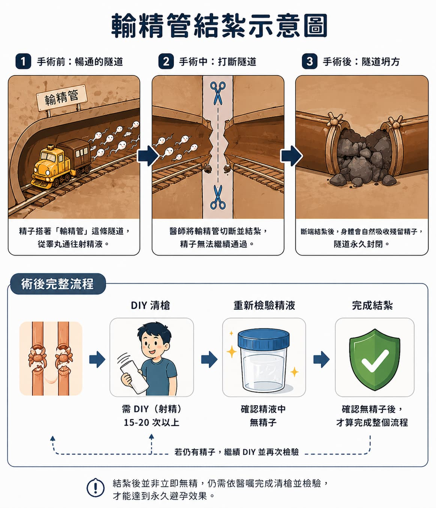

> **摘要：** 輸精管結紮是一種針對男性的長效避孕方式，透過結紮或截斷兩側輸精管，阻斷精子輸送到精液中。本文由泌尿科專科醫師說明手術目的、適應症、手術方式、常見疑問與術後自我照護。
> 由專業醫師說明，不同於臨時避孕，男性結紮屬於穩定且效果高的生育計畫選擇。

## 輸精管結紮是什麼？

輸精管結紮（Vasectomy）是透過顯微手術將兩側輸精管結紮或切除，阻斷睪丸產生的精子進入射精液。這個過程不會改變性慾或勃起功能，因為雄性荷爾蒙和血流供應並未受到影響。

## 適合什麼時候考慮？

這項手術通常適合以下幾種情況：

* 已完成生育計畫，希望穩定避孕的男性
* 與伴侶共同討論過並同意永久避孕的情況
* 因為伴侶不適合懷孕或需要避免女性避孕藥物副作用時

輸精管結紮屬於永久性避孕措施，因此決定前應經過充分諮詢與共同討論。

## 手術原理與流程

### 1️⃣ 手術原理

輸精管是精子從睪丸運送到射精液的通道。結紮後，精子無法經由輸精管進入射精液，自然會被身體吸收。射精時的液體主要仍為前列腺液與精囊分泌物，外觀與體積基本不變。\
\

### 2️⃣ 手術方式

* **傳統切開法**：在兩側陰囊各開一個小切口，找到輸精管後結紮或切除。
* **無刀結紮法**：使用特殊器械在陰囊打開極小孔，減少出血與腫脹。

兩種方式皆屬門診手術，通常不需要住院，手術時間約 15-30 分鐘。

## 會影響性功能嗎？

這是患者最常問的問題。

* **性慾**：不會改變，因為男性荷爾蒙仍然正常分泌。
* **勃起與射精**：也不會受到輸精管結紮影響。
* **射精感覺**：大部分患者感覺沒有差異，因為精液的主要成分仍然存在。

輸精管結紮的主要改變是「精液中不含精子」，而非改變性功能本身。

## 是否會恢復生育能力？

輸精管結紮被視為永久避孕，但在特殊情況下可以透過重接手術嘗試恢復。成功率會受到結紮時間長短、術後組織狀態與醫師技術影響。

如果你希望未來保留選擇，**術前一定要與醫師討論是否適合結紮**，以及是否需要冷凍精液備用。

## 術後恢復與注意事項

### 立即術後

* 可能出現局部腫脹、輕微疼痛或瘀青
* 建議冰敷 24-48 小時，並避免劇烈活動
* 術後 1-2 天可洗澡，但避免浸泡熱水

### 追蹤與驗證

因為結紮後精液中仍可能存在殘餘精子，通常需要術後 8-12 週並經過 15-20 次射精後，透過精液檢查確認無精子，才能沒有避孕措施。

### 常見自我照護

* 穿著有支撐力的內褲，減少陰囊拉扯
* 避免提重物、騎乘自行車或劇烈運動
* 若出現持續疼痛、發燒或大量出血，應立即回診

## 你該如何準備？

* 與伴侶共同決定避孕方式，並清楚了解優缺點
* 手術前告知醫師既往病史、用藥與過敏狀況
* 若有擔心，可先安排醫師諮詢，了解術後恢復與常見困擾

## 醫師提醒

輸精管結紮是穩定、有效且安全的男性避孕方法，但它不是臨時避孕。若你重視未來生育選擇，請先做好諮詢與規劃。

> 📌 本文為衛教資訊，實際診斷與治療仍須由醫師依個人狀況詳細評估。  \
> **下半身的守護者｜周孟翰醫師**

\#周孟翰醫師 #下半身的守護者 #輸精管結紮 #男性避孕 #生育規劃 #衛教 #新店高美泌尿科 #新店泌尿科 #台北泌尿科
